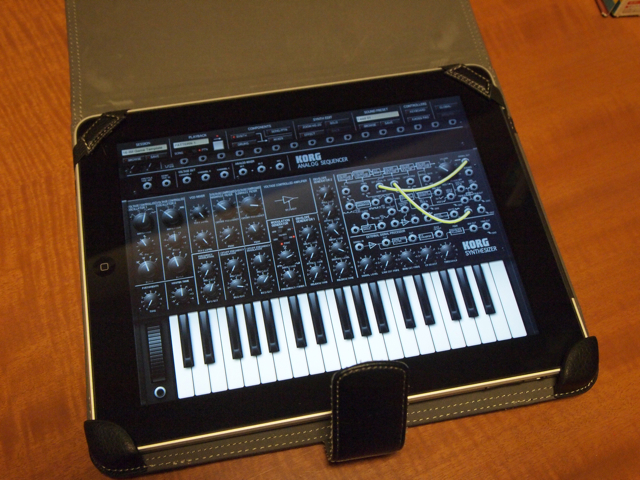

KORGよりiPadで動くアナログ・シンセ・スタジオ[iMS-20](http://www.korg.co.jp/Product/Synthesizer/iMS-20/)がリリースされました。[MS-20のオーナー](https://kanpapa.com/korg/)としては使ってみるしかないと思い、 iTunes App Storeで購入してしまいました。お値段は1800円（期間限定）。初めて1000円を超えるアプリを買いました。  
  
しかし、この機能に比べると1800円は安い。本当にMS-20が再現できています。おまけにさすがに買えなかったアナログシーケンサーとかKAOSS PADとか追加機能がてんこもりです。プリセットのサウンドも充実しています。  
すごく気にいってしまったので、KORGがだしているもう一つのiPadアプリ [iELECTRIBE](http://www.korg.co.jp/Product/Dance/iELECTRIBE/) まで買ってしまいました。こちらも適当にいじるだけでいろんなビートが刻めます。こちらも期間限定価格で1200円。  
  
KORGが次はどんなiPadアプリをリリースしてくれるのか楽しみです。
