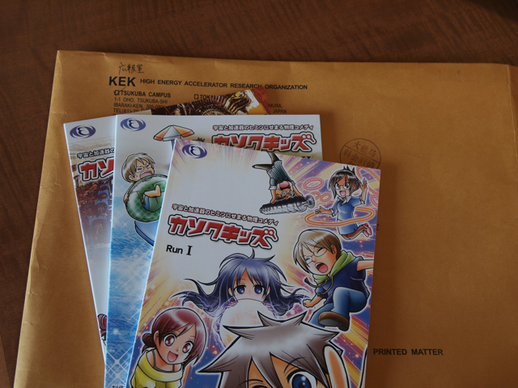

先日、[宙博（そらはく）2010](http://www.sorahaku.jp/)に出かけてきました。 あとから、いろんなかたのブログを拝見していると、高エネ研の加速器の展示コーナで子供向けの小冊子を配っていたようだとのことでした。加速器についてマンガで説明しているような内容のようです。 どんなものかなと高エネ研のサイトを見てみると中学生・高校生向けに宇宙と加速器のヒミツにせまる物理コメディ[「カソクキッズ」](http://www.kek.jp/kids/comic/)という漫画がサイトに掲載されていました。しかも製本された[単行本も配布](http://www.kek.jp/kids/comic/booklet.html)しているようです。早速私も３巻を２セット（私と子供の）申し込んでみました。 数日して届いたのがこんな立派な本でした。封筒も立派。  中身はやさしくは書かれていますが、それなりの知識は必要かもしれません。 私はまだ１冊目しか読んでいませんが、高エネ研が何をやっているのかは理解できるのではないかなと思います。 宇宙や科学に興味のあるお子さまにぜひ紹介してはと思います。
