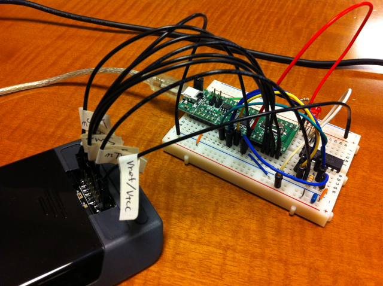

最近書き込みが少なくなっていますが、これはOpenOCDとJTAGにかなりハマっているためです。 JTAG I/Fは秋月のFT2232D基板を使って作ることができました。 ターゲットとしてインターフェース誌2009年5月号の付録ARM LPC2388基板をつなげたところ問題なく動きました。  ここでは動作中の画面はありませんが、reset halt, resume, reg, stepといったOpenOCDのコマンドを使ってARM基板を制御することができました。 stepでステップ実行をすると、pcがカウントアップされ、レジスタの中身も変わります。ここまでは正常に動いているようです。 次にHP20bをつなげたのですが、  どうしてもうまく通信できません。 かなり試行錯誤しています。同じARM7のLPC2388ではあっさりつながり、HP20bではつながらないので悩み中。 詳細な手順とかもまだまとまっていないので、まとまったらアップします。 HP20bのCPUはAT91SAM7L128なのですが、このCPUをJTAGで制御できたという情報があったらぜひコメントをください。
