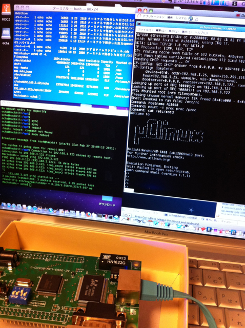

ひょんなことから、秋月の[AKI-H8/3069Fボード](http://akizukidenshi.com/catalog/g/gK-01271/)を２枚入手しました。  
H8マイコンとシリアルI/F、LAN I/Fが載ってます。添付のCD-ROMにはH8/OSが入っていましたが、調べてみるとすこし古いですが以下のような記事を見つけました。  
[@IT MONOist - 山あり谷あり、非力なマイコンでuClinuxを動かすべし](http://monoist.atmarkit.co.jp/fembedded/articles/softhard/03/softhard03a.html)  
まさにやってみたいことが載っています。  
というわけで、この記事を参考にしながら、uClinuxを動かしてみました。  
まずは作業環境を整えないといけません。私の場合はMacBook Proを主に使っているので、この手のものを試すときにはParallels Desktop上のLinux環境で行います。ついでに少し古いLinux環境しか無かったので、最近リリースされたDebian 6.0を新たに仮想マシンにインストールしました。この上でカーネルのコンパイルとかもできるのですが、今日は時間がなかったのでサイトに掲載されているバイナリを使用しました。もっと新しいuClinuxのソースもあるようなので、それも試してみたいと思います。  
まず、MacBook ProとH8/3069FボードをUSB-シリアル変換ケーブルで接続し、ブートローダーとなるRedBootをh8writeでボードのフラッシュROMに書き込みます。minicomを起動してリセットしたところ、無事RedBootが起動しました。  
ネットワークブートするための環境は、LinkStationにDebianを載せたhackkitで、tftpサーバとNFSサーバを動かして、そちらにカーネルとファイルシステムを置きました。  
特に問題なく作業は進み、H8/3069FボードでuClinuxをブートすることができました。フラッシュROMに我が家のネットワークの情報と起動スクリプトを組み込みましたので、H8/3069FボードをHUBにつないで電源を入れるだけで、uClinuxが起動します。

実際にアプリケーションも動かしてみたいと思いますが、今日は時間が無くなったので来週にでも。
