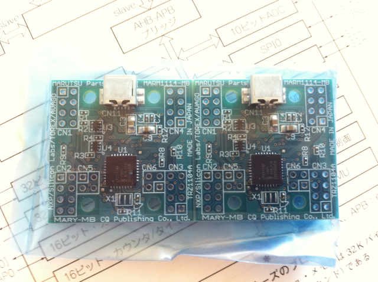

昨日発売されたトランジスタ技術増刊「２枚入り！組み合わせ自在！超小型ARMマイコン基板」を買ってきました。付録として超小型ARMマイコン基板が２枚ついてきます。  
その前に先日マルツパーツ館にてこのマイコン基板の拡張基板を予約注文したものが、前日に到着していました。購入したのはOB（カラー有機ELディスプレイ基板) 1枚、UB（アナログ入出力＆スイッチ基板） 1枚、CB（ユニバーサル基板） 2枚、連結ケーブル2本です。

増刊号には32ビットARMマイコンLPC1114FHN33/301が載った基板が２枚ついてきます。

複数のマイコン基板を接続して連携して動かせるのがこのマイコン基板の特徴なので最初から２枚ついているのはありがたいです。（これをMARYシステムと呼びます。）

雑誌から取り外すとこんな感じです。２枚の基板がくっついています。折って２枚にする必要があります。

力を余りかけずにゆっくり折れ目に沿って折るとこのように２枚になります。

増刊号の記事の通り、CP210x USB to UART Bridge VCP Driversのインストールと、FlashMagicのインストールを行い、サンプルプログラムを動かしてみました。  
MBボードの本体についているLEDは非常に明るくて、直視すると残像が残ってしまうぐらいです。

マルツパーツで購入した拡張基板を接続するためには、手持ちのピンヘッダをハンダ付けするのですが、２×２のピンソケットも２つ必要なようです。とりあえず、OB基板への接続はピンヘッダだけでいいようなので、ピンソケットは今度秋葉原に行ったときに調達することにします。

OB基板を取り付けて、サンプルプログラムを動かしたところ無事画像が表示されました。非常に奇麗です。

他のサンプルプログラムも動かしてみましたが、サンプルプログラムの出来がすごく良いので大変参考になりそうです。

開発環境のLPCExpressoの設定も終わり、ビルドもできました。少し環境周りを理解する必要がありますが、面白い素材なのでじっくり取り組んでみたいと思います。次は２枚のMBボードを接続して試してみます。

※Amazonではすでに売り切れのようです・・・・。
