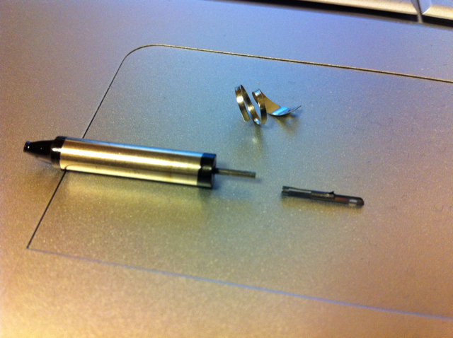
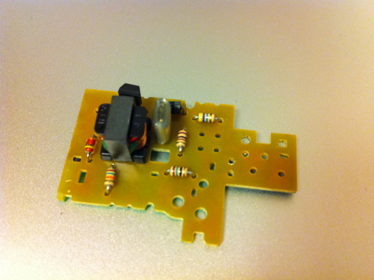
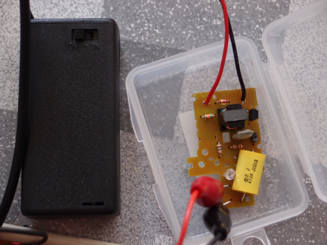
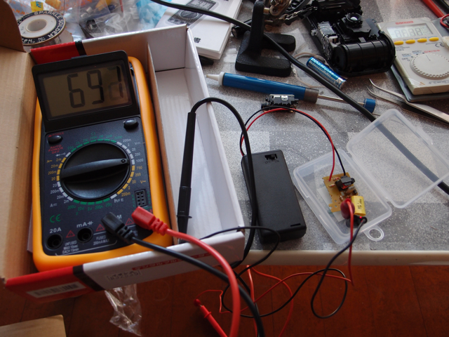

秋月電子でGM管（GM Tube D3372 浜松ホトニクス株式会社製）を在庫限り個数限定で売っているという情報をもらったので思わず買ってしまいました。  
その日のうちに売り切れてしまったようです。  
到着したGM管はこんな感じ。かなり小さいです。  
  
このGM管ですが、インターネットで検索するとかなりの情報がヒットします。  
どうもこれを使うには600V程度の高電圧が必要とのことで、みなさん使い捨てカメラのストロボ回路を流用しているようです。  
というわけで、わたしもその回路基板を入手しました。（高電圧を扱うので感電の危険を伴いますから細かいことはここでは書きません。自己責任でお願いします。）  
その基板はこんな感じです。不要な部品は外してあります。  
  
本来は単４電池１本(1.5V)から300Vぐらいの出力電圧を作っていますが、２倍の電圧、つまり単３電池を２本(3V)にすることで、600Vぐらいの電圧が出力できるそうです。ただし、出力電圧が倍になるのですから、高耐圧の部品に交換する必要もでてきます。平滑回路としてコンデンサを付けていますが、この写真に写っているものは630V耐圧のものです。（この写真では１個になっていますが。後述の実験結果から２個に増やしています。）  
  
実際に動かしてみました。  
  
この実験では697Vぐらい出ているようです。GM管を使うには十分な電圧です。  
とりあえず、下準備ができたところで、今週はここまで。
