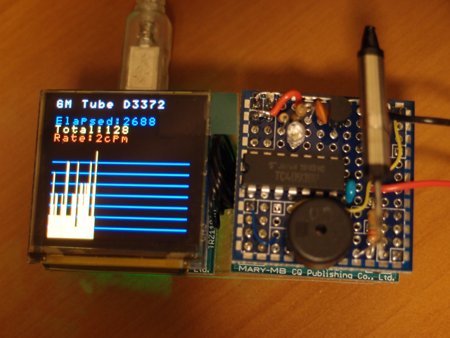

MARYシステムのCB基板（ユニバーサル基板）に秋月で購入したGM管 D3372を載せてみました。さすがに高圧発生部(600V)は外付けです。  
CB基板はやはり狭くパーツのレイアウト決めに時間がかかってしまいました。  
GM管との接続回路自体は秋月のキットの回路図を参考にしています。  
プログラムのことを考えて、UB基板と互換を持たせるように配線しました。圧電ブザーはCN2\_1に、GM管からの出力パルスはCN4\_7に接続しています。  
MB基板を２枚接続し、１枚はこのGM管基板、もう１枚はOB基板を接続し、mbedのときのようにOLEDに計数とグラフを表示するようにプログラムしました。

うまく動いてくれています。プログラムはかなり適当につくったのであまり良い出来ではないのですが、APIに助けられています。現状だと電源が２系統必要です。コンパクトに組めたので持ち運びができるようにしてみたいですね。
