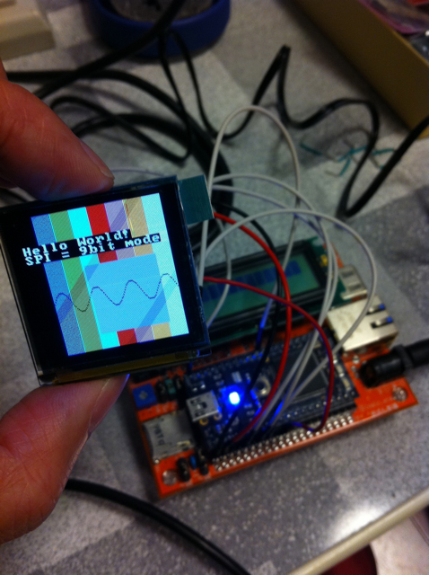

mbedに[MARYシステムのOB基板(OLED)](http://toragi.cqpub.co.jp/tabid/412/Default.aspx)を接続してみました。  
というのも@nxpfanさんがmbed で [MARMEX\_OB 基板(OLED表示)を制御するライブラリ](http://mbed.org/users/nxpfan/notebook/MARMEX_OB_oled_lib/)(MAPLE基板を利用)を公開されていたからです。  
今まではキャラクタLCDを[Starboard Orange](http://mbed.org/cookbook/StarBoard-Orange)で接続していましたが、ガイガーカウンタの出力をもう少し見やすくできないかという目的もありました。

とりあえず、回路図とMARMEX\_OB基板用のライブラリをにらめっこして、mbedに直接接続して、@nxpfanさんのサンプルプログラムを動かしたところ、問題なく表示されました。  
接続方法はこんな感じです。この接続は@nxpfanさんのサンプルプログラムに合わせています。

```
OB基板 mbed----------------------CN1_1 GND(0V)CN1_2 VU(+5V)CN1_3 VOUT(+3.3V)CN4_4 p5 (SPI mosi)CN4_2 p7 (SPI sck)CN3_2 p8 (cs)CN3_1 p30 (rst)CN2_1 p11 (power control)
```

このOB基板はMARYシステム用に開発されたものではありますが、2.54mmピッチの基板に簡単に取り付けができ、使いやすいものになっています。OB以外の各種基板もいろんな用途に活用できると思います。



でもこのままでは配線が宙ぶらりんで実用にはなりません。  
そこで思いたったのが前回のMake Tokyo Meetingで@shintamainjpさんからいただいた [StarBoard Orange 専用拡張基板：LCDインターフェースユニバーサル基板](http://mbed.org/users/shintamainjp/notebook/starboard-orange_lcdifbrd_ja/)に実装してしまうことです。  
StarBoard Orangeとユニバーサル基板の接続はLCDで使用している14Pのピンヘッダで接続しますが、その中で4つのピンが未使用です。ここにOB基板で使用しているSPI信号と+3.3Vを引き出すことにしました。その他の制御信号はLCD用のものを流用することにしました。具体的には以下のようになります。

```
CN8-------------------1 VLCD (+5V)2 VSS (GND)3 -2V 4 RS (p24)5 VSS (GND)6 E (p26)7 N.C.　← 【改造】+3.3Vに接続8 N.C.　← 【改造】SPI mosi(p5)に接続　9 N.C.　← 【改造】SPI miso(p6)に接続 ※今回は使用しないので接続を省略10 N.C.　← 【改造】SPI sck(p7)に接続　11 DB4 (p27)12 DB5 (p28)13 DB6 (p29)14 DB7 (p30)-------------------
```

この改造を行った場合は標準のLCDが使えなくなってしまいますが、使用していないLCD側のピンを切断することで、標準のLCDでも使用できるようにしておきました。


完成したStarBoard OrangeのOLED基板はこんな感じになります。右側にフリースペースもできたので、ここにも回路を載せることができます。


表示情報も格段に多くなりますので、非常に気に入りました。  
今はMARYシステムと兼用して使っているので、mbed用にもう１枚OB基板が欲しいです。  
これをガイガーカウンターで活用してみようと思います。
