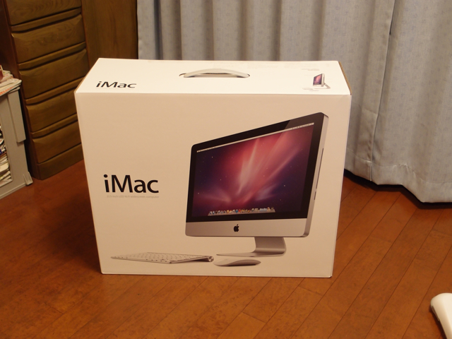

これまでMacBook Pro 15を使ってきたのですが、CPUがCore2 Duoでメモリも3GB以上に拡張できないという代物で、Parallels DesktopでWindows XPを使うとかなり遅くなってしまいます。おまけにバッテリーもダメになっていて、ノートタイプでありながら電源アダプタが手放せないという有様でした。  
なんとか我慢して使ってきましたが、先日の新iMacの発売で久しぶりにデスクトップも良いかなと考えてしまいました。  
最近お出かけするときはiPad 3Gを持っていきます。電源を入れればすぐネットワークに接続できて（たまに圏外もありますが。）、Webも見えるし、メールも読める。iPhoneとは違いソフトキーボードも大きく、7notesとかで物書きもできる。もし、Windowsを使いたいときはWiFiだけどVAIO type Pもあるし。特にノートタイプにこだわる必要はなさそうです。  
お店で実物を見てみましたが、画面が広いです。ウィンドウがたくさん置けます。Parallels Disktopを使って仮想マシンを沢山立ち上げても問題なさそうです。メモリも簡単に増設できるみたいです。ただし、我が家はそんなに広くもありませんし、激速である必要もないので、一番安い21インチのiMacを購入することにしました。  
到着したところ、箱がでかい！

  
この迫力には参りました。  
早速箱から取り出して設置しましたが、机の上が思ったよりスッキリしました。iMacにはマウスも標準で付属しているのですが、私はやっぱりトラックボールがいいので、そのままトラックボールを接続して使っています。  
最初に電源を入れたとき、起動音が大きくてあわてて音量を下げました。  
これまでは、初代Mac miniからずっと上書きアップグレードを続けてきた環境だったので、今回はまっさらな状態から環境を作ってみました。とりあえず、Mac Book Proのユーザディレクトリだけ、FireWire 800を使って、新しいiMacにコピーしました。

あとは最低限必要なアプリケーションを順次インストールしていきました。  
次にiPhoneを接続したところ、iTuneで認証画面になりました。いつも使っているMobileMeのIDとパスワードをいれたところ、またまた認証画面になりました。なんだろうなとよーく考えたらMobileMeに加入する前に使っていたApple IDとパスワードを聞いてきているのです。確かに昔購入した曲はApple IDでの購入です。IDとパスワードを思い出すのに時間がかかってしまいましたが、なんとか認証できて同期を取ることができました。  
あと、MacBook Proは一旦まっさらにして、再インストールしようと思ったので、iTunesの「Store」メニューで「コンピュータの認証を解除」しておきました。たしか５台までしか認証できないはずなので。念のため。  
これで一通りの環境はできましたが、メモリが標準では4GBしかないのでもう少し増やしたいと思います。
