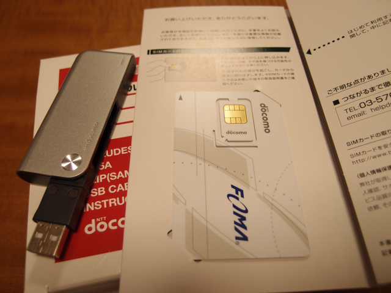

[イオン専用のb-mobile SIM](http://www.bmobile.ne.jp/aeon/index.html)を取り付けるデータ通信端末 [docomo L-05A](http://www.nttdocomo.co.jp/product/data/l05a/)が届きました。  
ヤフオクで送料込みで約1600円でした。これから取り付けるb-mobile SIMと一緒に記念写真をパチリ。  
  
今回の使用PCはVAIO type P (Windows 7)です。まずはWi-Fiを使ってドコモのWebサイトから必要なアプリケーションを入手しておきました。  
設定方法は以下のようになります。

1. b-mobile SIMをdocomo L-05Aに取り付ける。

3. PCに「L-05A接続ソフト」「L-05A通信設定ファイル（ドライバ）」をインストールする。

5. PCに「Windows® 7専用 L-05A通信設定ファイル（ドライバ）」をインストールする。

7. L-05AをPCのUSBに接続する。

9. L-05A接続ソフトの通信設定でAPNをdm.jplat.netに変更する。（初期値はmoperaとかになっている）

11. ダイヤルアップネットワークの設定を行い、モデムはL-05Aを選び、b-mobileで指定しているユーザ名、パスワードを設定する。

13. あとはダイヤルアップ接続を行いインターネットに接続する。

まずは、Yahoo! JAPANのトップページを見てみました。

速度に期待はしていなかったのですが、画面が表示されるのがすごく遅いとは感じませんでした。  
Yahoo! JAPANのページが最適化されているからかもしれませんが、思ったよりも使えると思います。  
次に今回の目的でもあるUNIXサーバへのsshアクセスです。接続先はこのサーバです。

  
  

シェルコマンドやviといった1バイト単位での送受信は引っかかり感があってやや使いにくいです。  
とはいえ、シェルコマンドやviも使えることは確認しましたので、緊急時の備えとしては十分でしょう。  
Webのようにデータがある程度連続して流れる場合はこの辺りは気にならないのだと思います。  
あとは実家でのアクセス状況を確認するだけですが、これは夏休みまでお預けということで。  
しかし、思ったより使えそうなので、スマートフォンでも試したくなってしまいました。  
docomoの[Xperia SO-01B](http://www.sonyericsson.co.jp/product/docomo/so-01b/)も[動作確認端末](http://www.bmobile.ne.jp/aeon/devices.html)なので、中古で安いものを探してみようかなと思います。新機種も出ていますので旧機種は安くなっているはずです。
