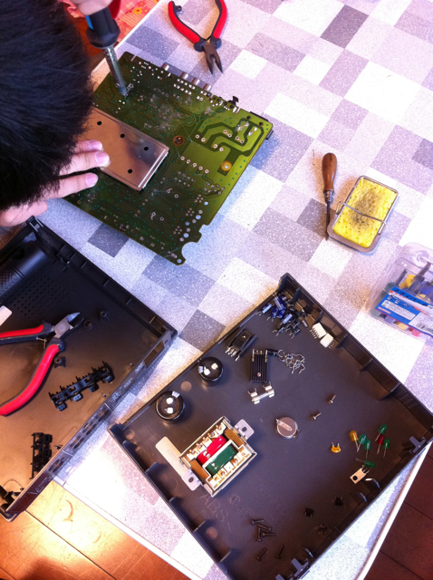

もう使わなくなったWOWOWのデコーダがありました。先日オライリーの「子どもが体験するべき50の危険なこと」も読んだこともあり、「34 家電品を分解しよう」に従って、子供に「これ使わないから分解してもいいよ」と渡してみました。 ドライバーやニッパやラジオペンチといった一通りの工具は自分専用のものを持っているので、私が愛用しているサンハヤトの「はんだシュッ太郎（はんだ吸取器） HSK-100」だけを貸してあげました。 私が子供のときは、ラジオやテレビがゴミ捨て場に落ちていたので、家に持って帰って分解していましたが、最近はこういうことはありませんので良い機会と考えました。 なお、万が一を考え、作業中は防護メガネを付けさせています。ハンダのくずやパーツの切れ端が目に飛んでくるかもしれませんので。 特に何も指示はしませんでしたが、ドライバーで見えるネジを外して、ケースのふたを取り外しました。  このあと基板を取り外すことはできたので、ハンダ吸い取り器の使いかたを教えたら、どんどん基板の上からパーツを取っていきました。  パーツを外すたびに「これは何？」と聞いてくるので簡単に教えています。抵抗、コンデンサ、トランジスタ、LED、赤外線受光素子（リモコンの受信部）などいろいろなパーツが手に入ったので、これを使ってまた別のものを作るのもよいかもしれません。 面白かったのは何も指示していないのに、取り外したパーツで同じ種類のパーツはまとめて置いていたことです。  すでに半分以上はパーツの取り外しが終わっていますが、まだ表面実装の部品が残っていて、完全に分解するまではもう少し時間がかかると思いますが、楽しく進めているようです。 やっぱり分解はおもしろいですよね。
