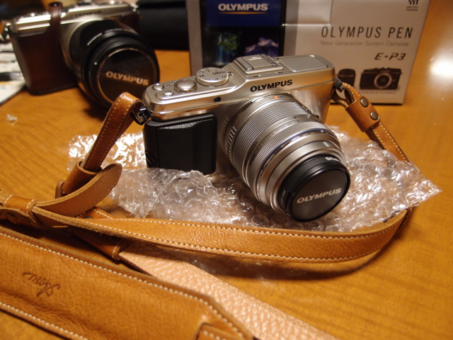

予定通りに発売日にオリンパス PEN E-P3が到着しました。  
液晶保護シートとプロテクトフィルタとPEN E-P1で使っていたストラップを取り付けました。

早速使ってみましたが、標準ズームレンズはずいぶんスマートになり、軽く動きます。  
液晶も明るく奇麗になりました。フラッシュも内蔵されました。（あまり使わないとは思うけど。）  
E-P1とは違いモードダイヤルが左側から右側に移りましたが特に違和感なく使えました。  
明日はこれを持って出かけてみたいと思います。
