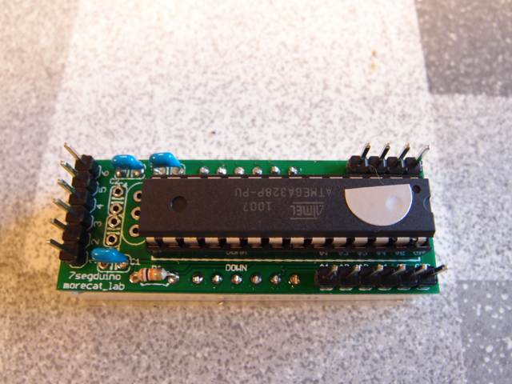

@morecat\_labさんから、7segduinoの試作版を試しませんかというツイートをみかけたのでお願いしたとこころ、7segduinoリード部品版パーツセット一式をお送りいただきました。  
7segduinoの詳細は@morecat\_labさんのサイトで紹介されています。  
[http://morecatlab.akiba.coocan.jp/lab/index.php/aruino/7segduino/](http://morecatlab.akiba.coocan.jp/lab/index.php/aruino/7segduino/)  
本来ですと、[SparkfunのFTDIアダプター](http://www.sparkfun.com/products/9115)がそのまま刺さるようになっていますが、私はあいにく持っていませんので、[秋月のFTDIモジュール](http://akizukidenshi.com/catalog/g/gK-01977/)を使うことにしました。  
7segduinoの組み立てですが、ハンダ付けの経験があれば特に問題なく作れると思います。  
部品点数も少ないので短時間で製作できます。  
注意すべき点としては、7セグLEDをハンダ付けする前にAVRに書き込みができるかの確認を行うことです。  
7セグLEDをハンダ付けしたあとは基板の裏側にはアクセスできなくなってしまいます。私はこれを忘れて7セグLEDまで取り付けてしまいましたが、無事一発で動作したので助かりました。  
また、7セグLEDを取り付ける方向は、基板にUP, DOWNと書かれていますので、これで合わせる必要があります。  
完成した7segduinoです。

秋月のFTDIモジュールとの接続は、ピンーソケットケーブルで以下のように接続しました。  
JP1(Sparkfun FTDIアダプタ)　CN2(秋月FTDIモジュール）  
\---------------------------------------------- 
1 GND　　　　　　　　　　　7 GND  
2 CTS (U1-11)　　　　　　　10 CTS  
3 Vcc (5V or 3.3V)　　　　　4 VIO  
4 TXO (U1-1) 　　　　　　　1 TXD  
5 RXI (U1-5)　　　　　　　　5 RXD  
6 DTR (U1-2)　　　　　　　2 DTR  
なお、秋月のFTDIモジュールのJ2はショート（USBから電源）、J1は2-3ショート(5V)とします。  
実際に接続するとこのようになります。

<figure>

<figcaption>

OLYMPUS DIGITAL CAMERA

</figcaption>

</figure>

この状態でiMacのUSBに接続したあとに、Arduino IDEを起動しLilypad Arduino 328とすることで、スケッチのアップロードもできました。  
サンプルプログラムを動かしてみました。

無事動作を確認することができました。  
最近は自動販売機の投入料金表示の7セグLEDでアニメーションをやっているのを見かけますが、あのような様々な表現を試してみたいと思います。  
また、I/O端子にセンサー類も取り付けられるので、ブレッドボードでいろんなセンサーを接続して、気に入ったものは基板にして7segduinoに取り付けると面白いでしょう。  
試作7segduinoをお送りいただいた@morecat\_labさんに感謝です。
