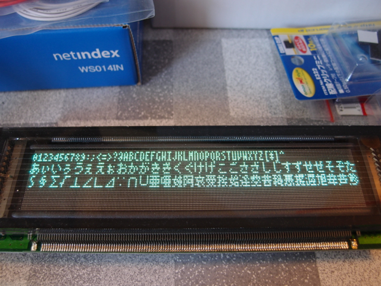

ハムフェアの500円VFDに文字を表示するために良いフォントが無いかなとつぶやいたところ、@gingaxxさんから、8ドットだったら@Sim0000さんの[プログラム](http://mbed.org/users/Sim/programs/FontTest3/)が参考になりますと教えていただきました。SPILCD用のテストプログラムでしたが、8\*8ドット日本語フォント「[美咲フォント](http://www.geocities.jp/littlimi/misaki.htm)」がヘッダとして組み込まれているので利用できそうです。 まずはカーソル制御などは行わずにVRAMにそのまま書いて、VFDに表示してみることにしました。  残念ながらフォントデータの仕様が合わず、そのままVRAMに書き込むと上下が逆になってしまいました。 データのビット順を逆に並べ替えてVRAMにかきこんでみたところ、正常に表示されました。  ご覧のように４行まで表示することができそうです。8ドットフォントなので、漢字はやや読みにくいですが、一般的な文章であれば流れで読めると思います。 まだVRAMに書いただけなので、カーソル制御や改行制御などは実装していませんが、VFD制御の部分はクラスライブラリにしているので、そちらに組み込んでいきたいと思います。フォントデータもこのVFDに合わせてデータ変換をしたほうが良さそうです。 せっかくmbedを使っているので、ネットワークに接続して、何らかの情報を表示できるようにしてみたいです。
