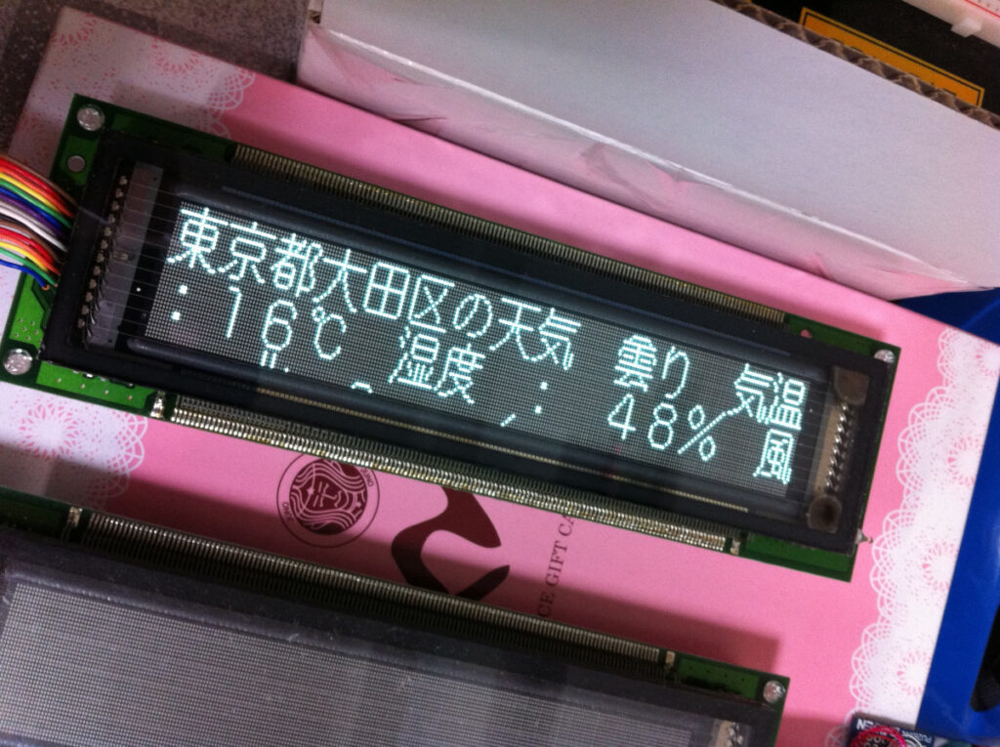

先日作ったお天気情報表示板ですが、16ドットfontx2を縦方向に32ドットに変換表示して、横スクロールをするようにしてみました。

https://youtu.be/0NhOMDdwN-U

これで良く街中で見かけるような情報表示板になりました。MTM07にはこれを持っていこうと思います。  
まだ表示されるのは大田区だけですけど、MTM07までには他の地域も表示するようにアレンジしてみます。
