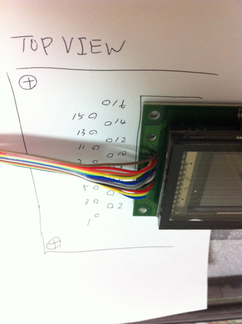

MTM07の開催が迫ってきましたが、プロトタイプとはいえ、２日間の出展に耐えられるようにある程度頑丈にしておく必要がありそうです。 まずは、ブレッドボード上のDC-DCコンバータを基板に組み直しました。 これまで使ってみようと買っておいたブレッドボード互換基板を試しにつかっています。  あとは、これまでシール基板での接続でしたが、これもフラットケーブルに置き換えて耐久性をあげています。  接続側はejackinoの方式です。  あと１セットVFDは準備しておこうと思います。 フラットケーブルでLPCXpressoに接続して無事動作確認ができました。 
