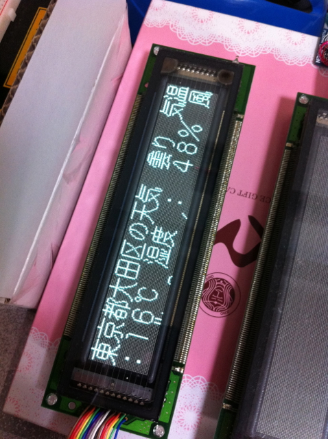

あと２週間に迫ったMTM07に向けて、mbedをネットワークに接続し、何らかの情報をVFDに表示することを考えていましたが、なかなか良いネタがなくて結局Google Weather APIのお天気情報をVFDに表示することにしました。漢字フォントはFONTX2の16ドットのものを使用します。Google Weather APIを使った理由はサンプルプログラムが流用できることと、結果がS-JISで返ってくるので、そのままFONTX2のテーブルに当ててフォントデータを取り出せるからです。  
試行錯誤したあげく、特定の地域の天気情報が漢字フォントでVFDに表示されるようになりました。

32ドットフォントとか使えば、横スクロールとかもできると思いますが、やはりフォントファイルが大きくなってしまうので、今回は16ドットフォントでいきたいと思います。
