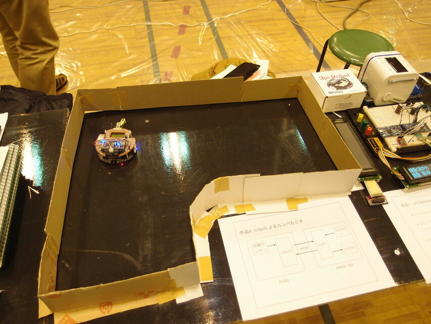
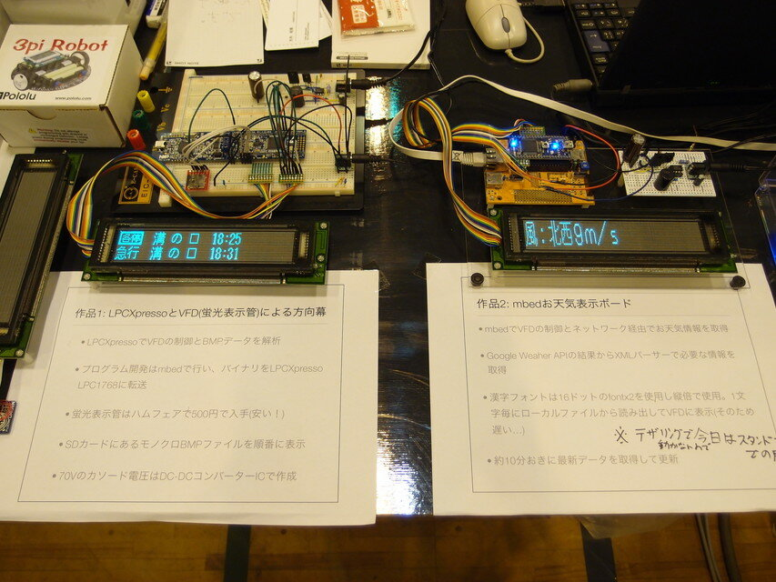
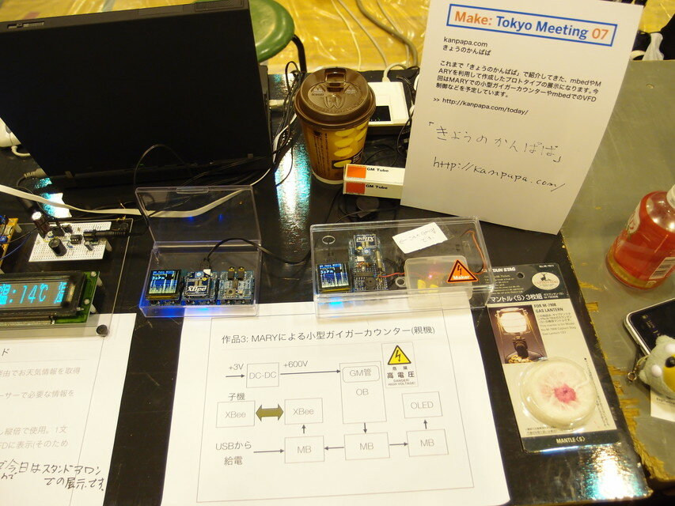

2011/12/3-4に東工大で開催されたMake: Tokyo Meeting 07 (MTM07) に出展しました。  
MTM07の出展風景です。

### m3piによるルンバもどき

記事は[こちら](https://kanpapa.com/2011/11/mbed-m3pi-distance.html "mbed robot (m3pi)に距離センサーをつけてみました")

### LPCxpressoとVFD蛍光表示管による方向幕とmbedお天気表示ボード

記事は[こちら](https://kanpapa.com/2011/11/vfd-mbed-weather.html "VFDでお天気情報を表示できました。")

### MARYによる小型ガイガーカウンタ

記事は[こちら](https://kanpapa.com/2011/04/mary-cb-gmt-ob.html "MARY CB基板にガイガーカウンタを載せました")

### 感想

展示内容はmbedが中心だったのですが、ネットワークは自前で準備しなければならず、b-mobileのイオン980円プランと怪しいxperiaのテザリングでなんとか助かりました。  
今回出展した作品の詳しい紹介は落ち着いてからまとめたいと思います。
