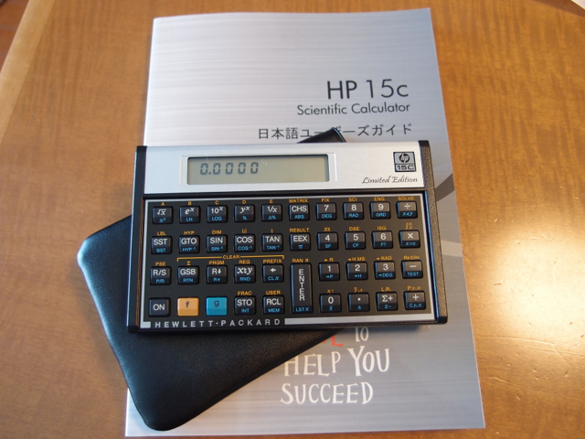

ひょんなことから、HP 15cを買っちゃいました。いわゆる復刻版というものです。

  
これまでRPN電卓は使ったことはないのですが、大昔にFIG-FORTHとか使っていたのでRPNは知っていました。  
このHP 15cには親切な日本語マニュアルがついていて、いろんな計算例があるので試しています。  
最初はどうしても今までの電卓のつもりで使おうとして計算ミスをしてしまいましたが、慣れるとカッコがないので速く計算できるようになりました。  
もちろん、裏には例の６つの穴があります。HP 20bみたいに。

ケーブルないかなぁ。
