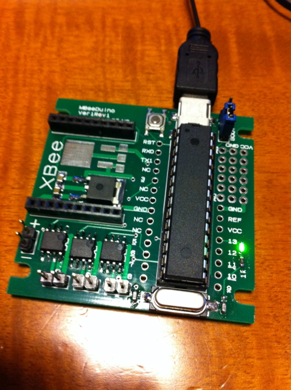
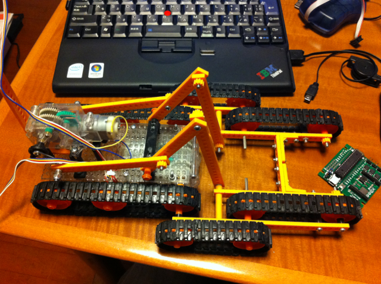
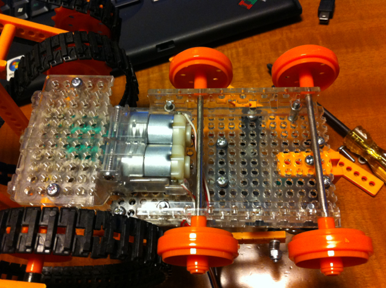

@naka\_at\_kureさんが、[MBeeDuino](http://www38.atpages.jp/~nakakure/pukiwikiplus/index.php?MBeeDuino)というArduino互換で3chモータードライバとXBeeが搭載できる生基板を配布されていたので分けていただきました。  
タミヤの模型に実装できるように穴の位置やサイズなどよく考えられており、我が家にあるタミヤの[レスキュークローラー](http://www.tamiya.com/japan/products/70169rescue/)に載せられないかなと思ったのです。  
部品を集めて完成したMBeeDuinoはこんな感じです。サイズも小さいです。

タミヤのレスキュークローラーはこんな感じです。かっこいいでしょ〜。

モーターが３つ搭載されていて、２つはキャタピラの回転制御、もう１つは前方のキャタピラを上下することができます。  
MBeeDuinoはモーターを３つ制御できるのでまさに最適です。  
どこに取り付けようかと考えましたが、一番広いスペースである本体の裏側に目をつけました。

試しにここにMBeeDuinoを取り付けたところピッタリです。

この状態でモーターと配線して、MBeeDuinoで制御してみました。  
キャタピラを１秒間隔で正転、逆転を交互に繰り返すようにプログラムしました。

問題なく動いているようです。  
ただ、残念なことにこのままでは肝心のキャタピラを固定するスペースがないので走らせることができません。  
そこでタミヤの楽しい工作シリーズの「ユニバーサルプレートセット」と「トラック＆ホイールセット」を利用することで、プレートを広くしたあとに、キャタピラを固定できないかと考えました。

交換するプレートを並べてみました。狭いですがキャタピラを固定できる程度のスペースは確保できそうです。

新しいプレートに取り替えたところ、MBeeDuinoの取り付けスペースとキャタピラの取り付けスペースが確保できました。

トラック＆ホイールセットのキャタピラを使って長さを調整し、モーターの位置も少し動かすことで、大きなたるみもなくキャタピラを取り付けることができました。

あとは電池をどうやって実装するかを考えなければなりません。また次回に続きます。
