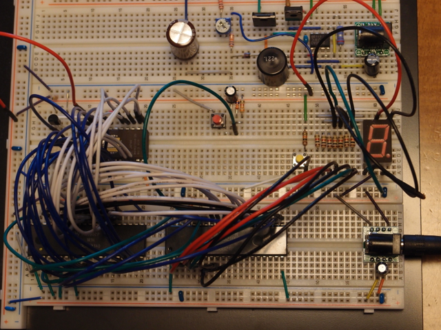

[工場ハック](http://jp.makezine.com/blog/2012/03/factory_hack.html)で手に入れたジャンク基板に懐かしの6802 CPUが載っていたので、ぜひ動かしてみたいと考えていました。

6802で検索してみると[6802 Nano computer](https://www.sbprojects.net/projects/nano6802/index.php)というシンプルな回路とサンプルプログラムが載っていましたので、まずはこれをブレッドボードで組み立てて、CPUが正常に動作することを確認してみました。

必要な材料は懐かしのUV-ROM 2732AとPIA 6821とあとは少々のパーツです。[2732Aは若松通商で150円](http://www.wakamatsu-net.com/cgibin/biz/psearch.cgi?page=0&word=2732)で売っていますので、これを買ってきました。

問題はPIA 6821です。これはなかなか手に入れにくい状況です。海外のサイトでは在庫限りで販売しているところがありますが、国内ではなかなか見かけません。いろいろ探したところ、[手創り屋](http://tetukuri.shop-pro.jp/)さんというお店でPIA 6821(¥263)を売っていました。ついでに懐かしい46505(¥263)というCRTCも売っていましたので、合わせて購入しました。

早速組み立てです。40P DIPを２個使いますので、少し広めのブレッドボードを使わないといけません。また同じボード上でサンプルプログラムにあるDice Gameの回路も実装します。組み立てた結果はまるでジャングルになりました。

写真の右上にある電源ぽい回路は以前作ったVFD用の電源回路なので、今回の回路とは関係ありません。

一番配線が集中している左下の40P DIPが6802で、中央下の40P DIPが6821、CPUの上にある少し小窓が見えている24P DIPが2732Aです。アドレス線は青、データ線は白で接続しています。Dice Gameの回路は本当であれば、サイコロの目のようにLEDを配置するのですが、スペースの関係で7セグメントLEDで代用しています。このためサイコロの目にはなっていません。

配線確認をして動作させたところ無事動きました。



CPUは正常のようです。折角7セグメントLEDを使っているので、数字として表示するようにプログラムを手直ししてみたいと思います。また、少し時間はかかると思いますが、6802 Nano computerのようにユニバーサル基板に実装しなおしてみたいと思います。
