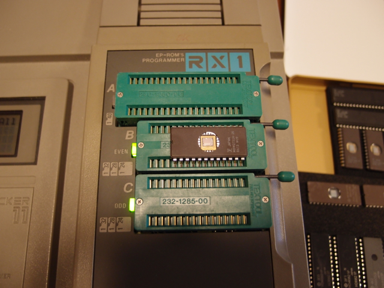
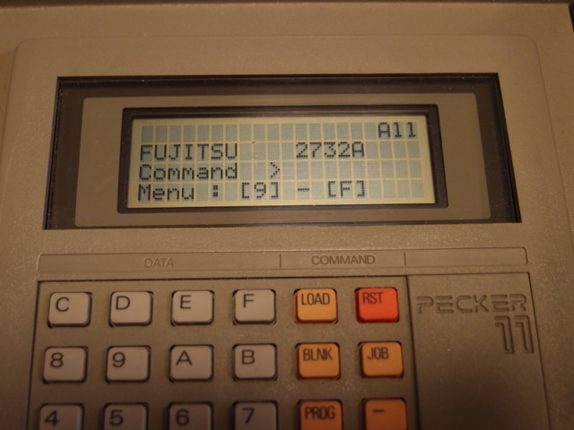
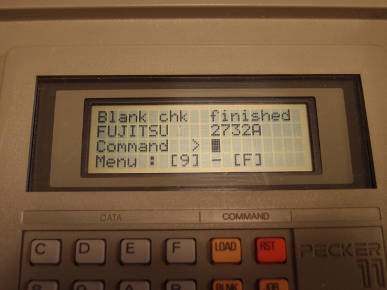

[AVAL PECKER-11](http://www.avaldata.com/products/y3_p_infomation/pecker_index_.html)で2732Aを焼いてみました。このPECKER-11は最近入手したものでして、使い方を忘れないようにまとめておきたいと思います。

### PCとのシリアル接続設定

PCとはRS232Cでシリアル接続をしますが、私の場合はiMacのParallels Desktopを使っているので、秋月の[USB・シリアル変換ケーブル\[M-00720\]](http://akizukidenshi.com/catalog/g/gM-00720/)に9P-25PのクロスケーブルをつないでPECKER-11につなぎます。

この状態で、シリアルの設定をします。

(1) 通信形式をデータ8ビット, ストップ1ビット, パリティ無しにします。

\[SET\] \[0\] で、\[SET\]キーと\[-\]キーを使ってD8 S1 Noを選びます。選んだら\[JOB\]キーで登録。

(2) 通信速度を9600bpsにします。

\[SET\] \[1\] で、\[SET\]キーと\[-\]キーを使って9600を選びます。選んだら\[JOB\]キーで登録。

(3) フロー制御をX-On/X-Offにします。

\[SET\] \[4\] で、\[SET\]キーと\[-\]キーを使ってXON/XOFFを選びます。選んだら\[JOB\]キーで登録。

(4) データフォーマットをIntel HEX形式にします。今回は6802のROMなのですが、アセンブラがHEXフォーマットを出力するもので。

\[SET\] \[5\] で、\[SET\]キーと\[-\]キーを使ってIntel HEXを選びます。選んだら\[JOB\]キーで登録。

(5) この状態でPC側でTeraTermを立ち上げて、COMポートを選び9600bps、データ8bit、ストップ1bit、パリティnone、フローXON/XOFFに設定します。

(6) 通信テストとして、PECKER-11のバッファRAMの内容をシリアルに出力してみます。

\[JOB\] \[C\] \[0\] 00000000 \[SET\] 00000FFF \[SET\]

これでHEXフォーマットがTeraTermの画面に出力されればシリアル通信は問題ありません。

### ROMの取り付け

今回焼くROMはFUJITSUのMBM2732A-25です。PECKER-11には簡単なイラストが書いてありますが、右よせでソケットにセットします。

セット後にROM種別をPECKER-11に設定します。\[JOB\] \[SET\] \[0\]でデバイスを自動認識するのですが、今回はうまく認識できなかったので、手動で設定しました。

(1) まずメーカー名の設定です。\[JOB\] \[SET\] \[1\] \[0\] で、\[SET\]キーと\[-\]キーを使ってFUJITSUを選び、\[JOB\]キーで登録します。

(2) 続けて型名の設定です。\[1\]を押し、\[SET\]キーと\[-\]キーを使って、2732Aを選び、\[JOB\]キーで登録します。

(3) 続けて容量の設定です。\[2\]を押すと、4KBと表示されますので、\[JOB\]キーで登録します。

(4) 続けて書き込み方式の設定です。\[3\]を押し、\[SET\]キーと\[-\]キーを使って、STANDARDを選び\[JOB\]キーで登録します。

これで2732Aが使える状態になりました。

### ROMのブランクチェック

まずはブランクチェックをします。

(1) \[BLNK\] \[SET\]と押します。問題なければ以下のように「Blank chk finished」と表示されます。

### 書き込むデータの読み込み

次に書き込むデータをPECKER-11のRAMバッファに読み込みます。今回は0x0000F000 に配置するROMなので、オフセットは0000F000とします。

(1) \[JOB\] \[D\] \[0\] 0000F000 \[SET\] と押すと、シリアルポートからの受信画面になります。

(2) シリアル接続したPCからIntel HEXフォーマットでファイルを送信します。受信が終わると画面がもとに戻ります。

(3) RAMバッファに正常に読み込めているかを確認します。

\[JOB\] \[0\] 00000000 \[SET\] と押すと、00000000の内容が表示されます。

今回は8Eで正しかったです。ここで\[SET\]キーを押すと次のバッファの内容が表示されますが、その内容も正しかったので、正しく読み込めているようです。なお、\[-\]キーで前のバッファの内容が表示されます。

### ROMの書き込み

いよいよROMに書き込みを行います。

(1) \[PROG\] \[0\] \[SET\] と押します。書き込みが始まります。（すぐ書き込みが終わってしまったので書き込み中の画面写真が取れませんでした。また次回にでも。）

(2) 書き込みが完了すると、finishedとチェックサムが表示されます。

これで2732Aに無事6802のコードが書き込めたようです。でも、ROMの窓に張るシールが無いなぁ。どこかにあったかな。
