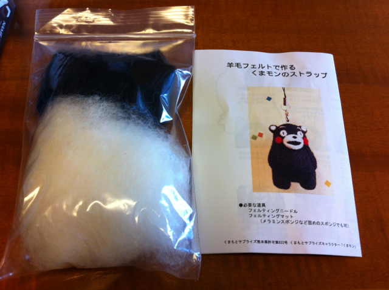
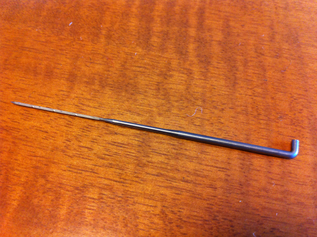
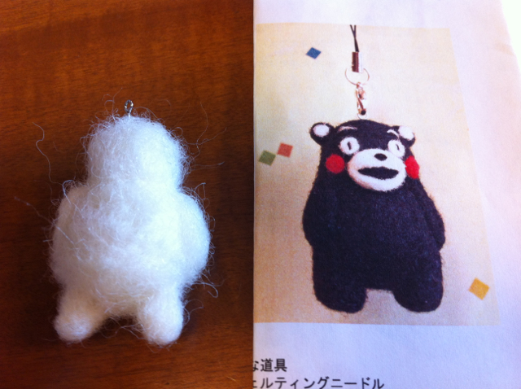

羊毛フェルトで作るくまモンのストラップを作ってみました。この商品は[くまもといっしょ](http://ameblo.jp/lovekumamon/)さんで販売されているものです。

私ははじめてだったのでスターターキット付きを購入しました。いつもはハンダ付けですが、たまにはこういうのも作るのもいいかなと。

届いた材料はこんな感じです。

道具はこの付属のニードルだけです。針の先に微妙に凸凹があるのがミソです。

これで羊毛を刺して固めたり、刺しこんで羊毛どうしをくっつけたりしていきます。まずは土台を作ります。こんな感じになりました。見本とは微妙に違いますが気にしない。

黒い羊毛で被います。それっぽくなってきました。

目、鼻、口、耳、しっぽをつけて、できあがり。

初めてなのでこのぐらいで勘弁してください。材料が余っているのでもう一体作ってみようと思います。
