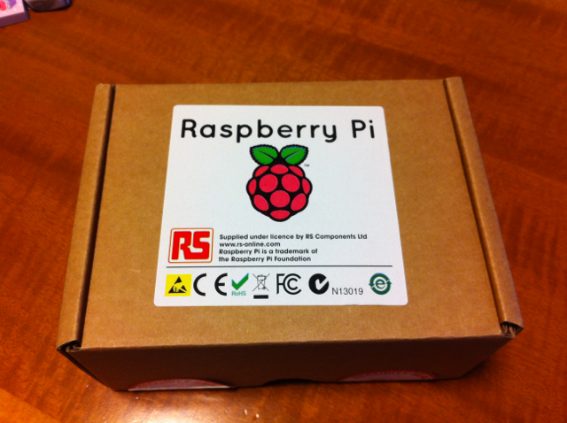
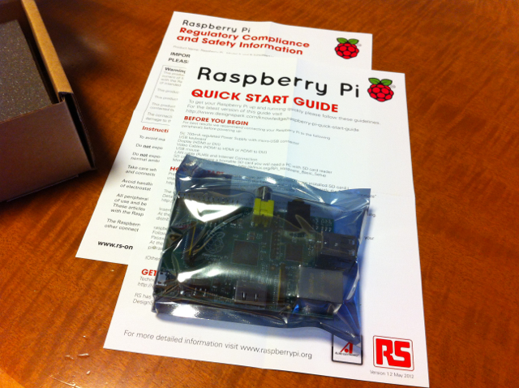

かなり前にオーダーしていたRaspberry Piがオリンピックで盛り上がっているイギリスから到着しました。

パッケージはこんな感じです。

中身は簡単な説明書（「QUICK START GUIDE」と「最初にお読みください」）が２枚と基板だけです。

本体基板の表面です。ネジ穴がないのでどうやって固定しようかな。

本体基板の裏面です。久しぶりに標準SDカードのスロットを見たような気がします。

残念ながら起動するためのSDカードをまだ作成していないので、週末にでも試してみます。
