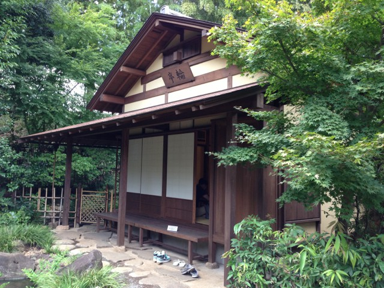
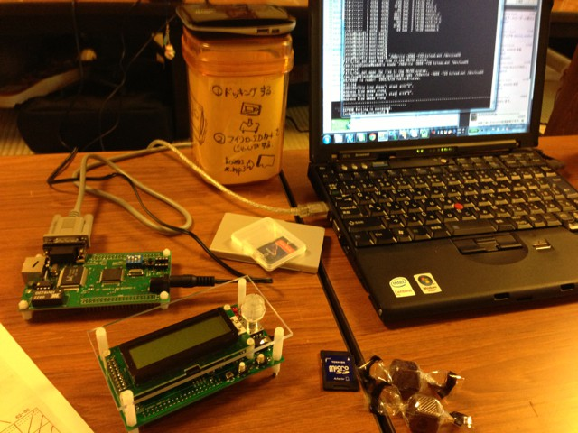
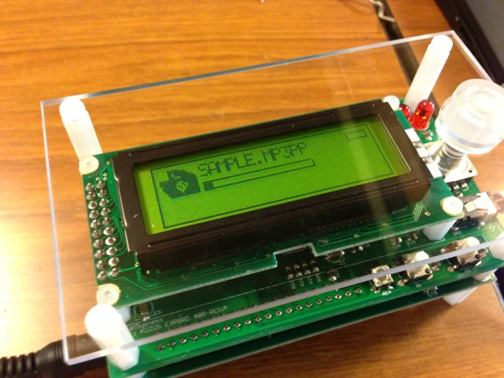
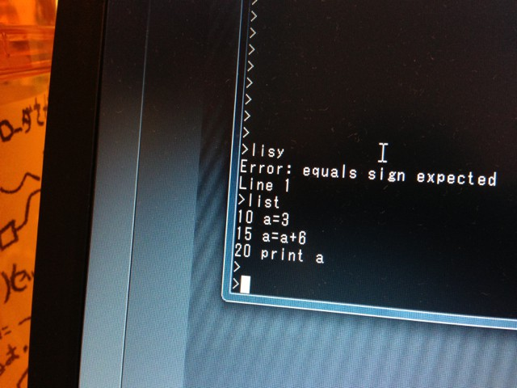
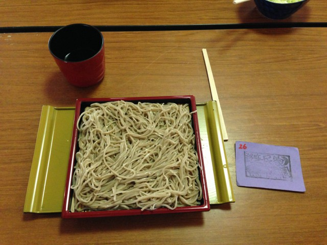
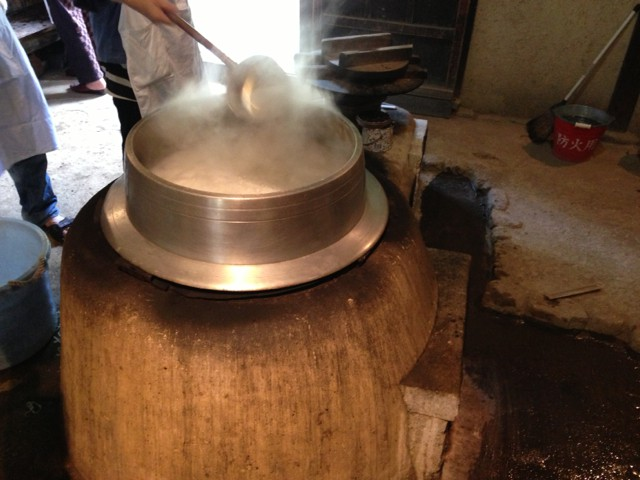
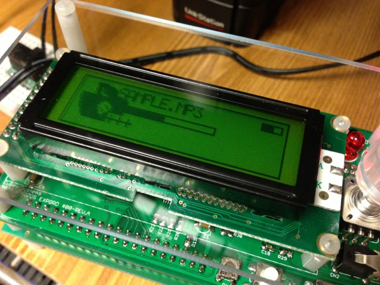
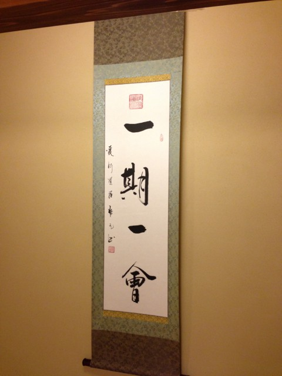

「茶室で楽しむKOZOS拡張基板」というイベントに出かけてきました。このイベントの詳細については[ATND](http://atnd.org/events/30481 "茶室で楽しむKOZOS拡張基板")や[CuBeatSystemsさんのページ](http://shinta-main-jp.blogspot.jp/2012/09/kozos.html "CuBeatSystems")をご覧ください。今回の参加者は１０名で、大阪や福島から来られたかたもいらっしゃいました。

会場となった都筑民家園の茶室はこんな感じのところです。茶室でお抹茶をいただいた経験は数回ありますが、さすがに長机を持ち込んでPCを並べて作業するのは初体験。



まずは今回使うプログラムやソースをUSBメモリからコピーして、今回のKOZOS拡張基板に対応したコンパイル済のブートローダーをAKI-H8/3069LANマイコンボードに書き込むのですが、ここが一番の難関で書き込めない人が続出。KOZOS本では第８章でブートローダーが完成し、それ以降は書き込みを行わないためかも・・。私の場合は直前までKOZOS本に取り組んでいたので無事書き込めました。



あとは拡張基板をマイコンボードに取り付けて準備完了です。この時点でテスト用のプログラムとMP3データをmicroSDカードにコピーして、拡張基板にとりつけRESETスイッチを押すと、MP3プレイヤーとして動き出しました。



次にNT-BASICが組み込まれたプログラムをmicroSDカードに上書きしました。シリアルコンソールからBASICが使えるようになります。しかも、MP3プレイヤーの機能も持っているので音楽を聞きながらBASICが楽しめます。



ここでBASICの話で盛り上がりました。RANDOMIZEとかFOR-NEXTとか懐かしいキーワードが飛び出しました。実は若いかたはBASICというものを触ったことがないそうで時代の流れを感じます。

午前中はこのあたりで時間切れになり、昼食には手打ちそばを頂きました。土間にある大きなかまどで茹で上げた二八そばをおいしく頂きました。



土間にあるこの釜でおそばを茹で上げていました。



午後はもくもくとソースを読んでいろんなことを試そうとしましたが、なかなか構造を理解するのが大変でちょっとした修正しかできませんでした。

まずはmicroSDカードに複数ファイルが入っていたときにファイル名の末尾の文字が消えていないバグを直しました。具体的には２枚目の写真でファイル名がSAMPLE.MP3PPとなっていますが、本当ならSAMPLE.MP3が正しいのです。これは最初にスペース文字列を表示してから、ファイル名を表示すれば良いので、task_fileio.cを以下のように修正しました。

```
$ diff -rc task_fileio.c.org task_fileio.c  
*** task_fileio.c.org   2012-09-29 14:40:35.000000000 +0900  
--- task_fileio.c       2012-09-29 14:43:02.000000000 +0900  
***************  
*** 109,114 ****  
--- 109,115 ---- 
                break;  
            }  
            while (!pf_readdir(&dir, &filinfo) && filinfo.fname\[0\]) {  
+               ipc_menu_set_filename("               ");  
                ipc_menu_set_filename(filinfo.fname);  
                if (!(filinfo.fattrib & (AM_DIR | AM_HID))) {  
                    if (is_music_file(filinfo.fname)) {  
```

あとはロータリースイッチを回す方向でLCDに"＋＋＋"や"ーーー"と表示するようにしました。task_menu.cを以下のように変更しました。

```
$ diff -rc task_menu.c.org task_menu.c  
*** task_menu.c.org     2012-09-29 14:52:40.000000000 +0900  
--- task_menu.c 2012-09-29 16:18:04.000000000 +0900  
***************  
*** 78,83 ****  
--- 78,84 ---- 
              _volume--;  
              LED_LEFT();  
              DISP_VOLUME(_volume);  
+           ipc_display_draw_text(24, 20, "---");  
          }  
      }  
      if (p\[2\]) {  
***************  
*** 85,90 ****  
--- 86,92 ---- 
              _volume++;  
              LED_RIGHT();  
              DISP_VOLUME(_volume);  
+           ipc_display_draw_text(24, 20, "+++");  
          }  
      }  
      NTLEVT_END(NTLUSR_TRACK_MENU, NTLUSR_EVENT_MENU_ROTARY);
```

パラメタを変えるとニジマス君の大きさが変えられるようになっていたので、そのあたりをいじったり、別のBMPファイルをロゴにして表示しようとしましたが、残念ながら途中で時間切れとなってしまいました。

```
*** 164,170 ****

  {  
    ipc_display_clear();  
    ipc_display_draw_box(0, 0, 121, 31, 1);  
!   ipc_display_draw_logo(2, 2, 0);  
    DISP_VOLUME(_volume);  
  
    while (1) {  
--- 167,175 ---- 
  {  
    ipc_display_clear();  
    ipc_display_draw_box(0, 0, 121, 31, 1);  
!   //ipc_display_draw_logo(2, 2, 0);  
!   ipc_display_draw_logo(2, 2, 1);  
    DISP_VOLUME(_volume);  
  
    while (1) {  
```

最終的なもくもくの結果です。ニジマス君が大きくなってはみでています。ロータリースイッチを回すと＋＋＋やーーーと表示されました。ファイル名も正しくSAMPLE.MP3と表示されるようになりました。



今回提供いただいたサンプルプログラムは拡張基板のデバイスをフル活用できる内容でしたので、ソースを読み込んでじっくり試してみたいと思います。

このような楽しいイベントを企画いただいた中村さんに感謝です。あと、坂井さんをはじめ参加された皆様お疲れさまでした。


