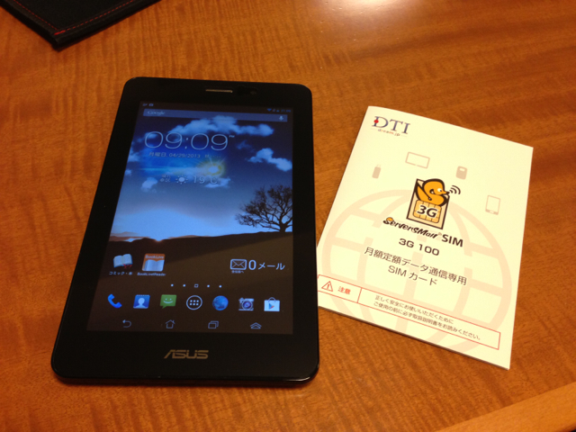
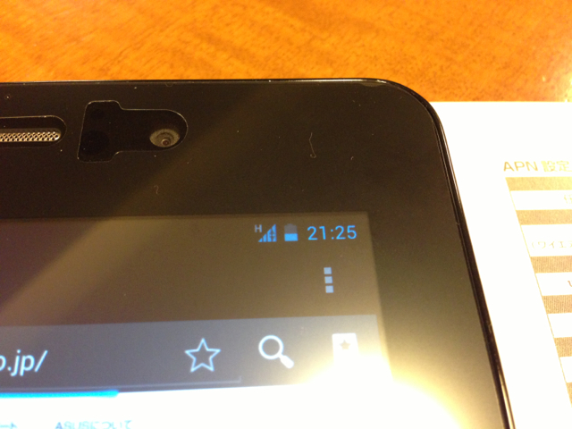

ASUS fonepad ME371MGを買ってしまいました。次期Nexus 7の噂があったのでそれを待っていたのですが・・。つい。 ヨドバシカメラでオーダーして翌々日には到着しました。 外箱はこんな感じです。  外箱をあけると本体がでてきました。 本体の左下に噂のはがれにくいお問い合わせ窓口シールが見えます。  裏面を見てみると、intel insideのロゴがあります。  外箱の横には本体色を示すマークがありました。日本だとグレーだけみたいです。  私の場合は液晶保護シールも合わせて購入しました。エレコムのTB-ASM37AFLFAというfonepad ME371MG専用シートです。  液晶保護シールを奇麗に貼るには、画面左下のお問い合わせシールがどうしても邪魔になります。このシールをゆっくり丁寧に剥いだのですが、やはり跡が残ってしまいました。非常に残念な感じです。  でも、このあと手持ちの液晶画面掃除用の布で丁寧に拭きあげて、なんとか粘着材を拭き取ることができました。  このあと液晶保護シートを慎重に貼ってきれいに仕上げることができました。  ここまででかなり疲れてしまいましたが、引き続き3GのmicroSIMカードを取り付けます。私は手持ちのDTIのServerman SIM 3G 100を使いました。いわゆる490円SIMなので、スピードは遅いのですが、3Gがあると活用範囲が大きく広がります。遅くてもいいので常にネットワークがつながっているのは安心感があります。  あと、ストレージとして8GBのmicroSDカードもとりつけました。  準備が整ったところで電源を投入。初期設定を行いました。もちろん3Gの設定も行いました。 ちゃんとアンテナマークが表示され、3G通信ができていることが確認できました。もちろん、Wifiも問題ないです。  所感ですが、動作もキビキビしており、特にストレスはありませんでした。 初めてのintel insideなので、大丈夫かなと不安もありましたが、今のところは動作しないアプリには出会っていません。 使い勝手もNexus 7と同等のように思えます。バッテリーの持ちも悪くはなさそうですが、もう少し使い込んでみないとわかりません。 この連休にはこれを持っておでかけしようと思います。
