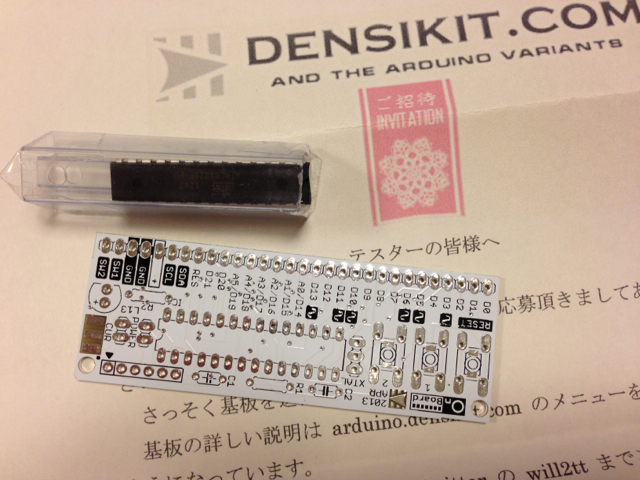

densikit.comさんがArduino互換でブレッドボードにそのまま差してつかう[OnBoard](http://arduino.densikit.com/home/onboard "OnBoard")というボードのテスターを募集していたので申し込みました。  
届いた基板はこんな感じで、白がカッコいいですね。ブレッドボードに合いそうです。また、ご招待レターも入っていて素敵です。

私はブレッドボードが大好きなので、このようなボードがあると便利だなあと思っていました。  
手持ちのパーツである程度組み立てはできそうなのですが、少し足りないものがあるので完成は少し先になるかもしれません。
