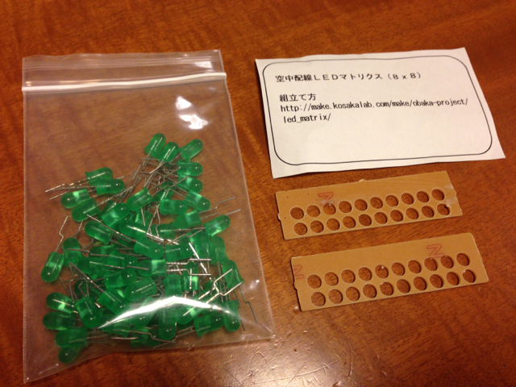
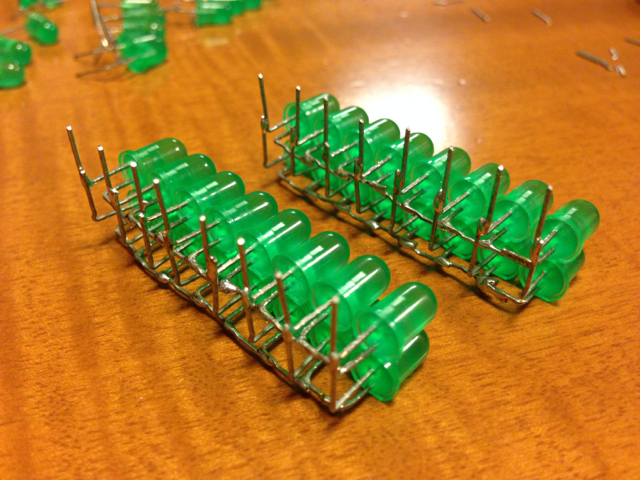
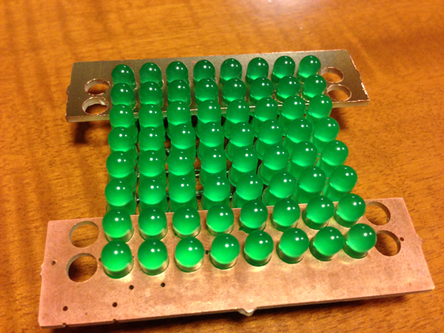
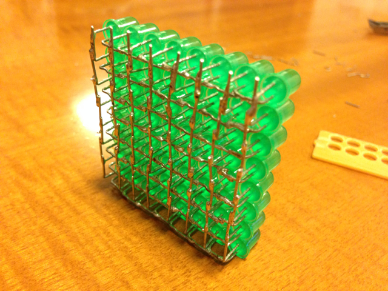
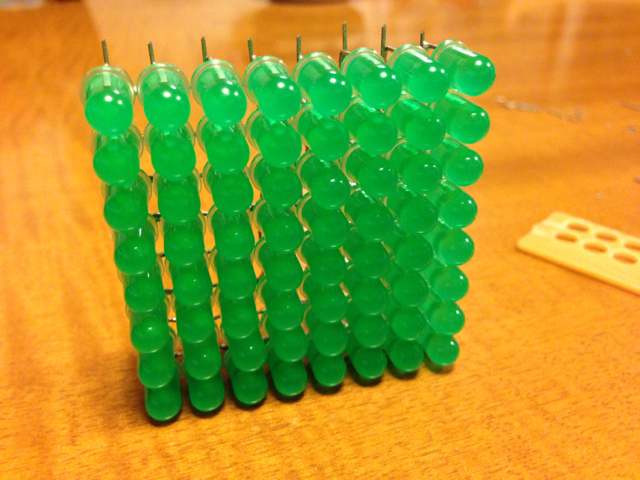

Maker Faire Tokyo 2013で配布されていた @kimio\_kosakaさんの[空中配線LEDマトリクスキット](http://make.kosakalab.com/make/obaka-project/led_matrix/ "空中配線LEDマトリクスの作り方")を組み立ててみました。

キットの外観です。

まず、typeAのLEDを作ります。

typeAのLEDが49個できました。

typeBからtypeDまで一気に作成しました。2個余りました。  

仮組み中。こんな感じかな。

はんだ付け完了

２セットできました。同じものをあと１セット作ります。

すべてのユニットができました。いよいよ組み合わせます。

４つのユニットを治具で結合しました。

各ユニット同士をハンダ付けしました。見た感じショートは無いかなと。

空中配線LEDマトリクスが完成しました。裏面です。

表示面です。

完成まで２時間ぐらいでした。キットに付属の治具の威力は素晴らしいです。

火入れはまた今度で。製作は楽しかったです〜。
