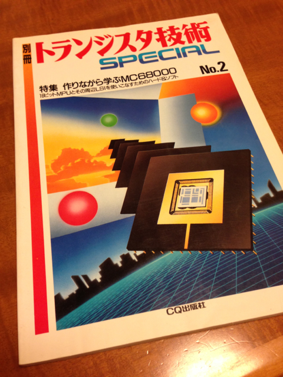

古本屋でこんな本を見つけたので思わず購入しました。

トランジスタ技術スペシャル No.2 作りながら学ぶMC68000

この本はトラ技で連載されていた記事をまとめたものですが、実際にこのマイコンを作ってCP/M 68Kまで動かしました。

でも、実家で保管していたら捨てられちゃったみたいで相当ショックを受けました。

ラッピングで凄い配線をしていたのを思いだします。

68000のハンドアセンブルはかなりめんどくさかったです。

デジカメも無かった時代なのでどこかに写真は残っているかなぁ。
