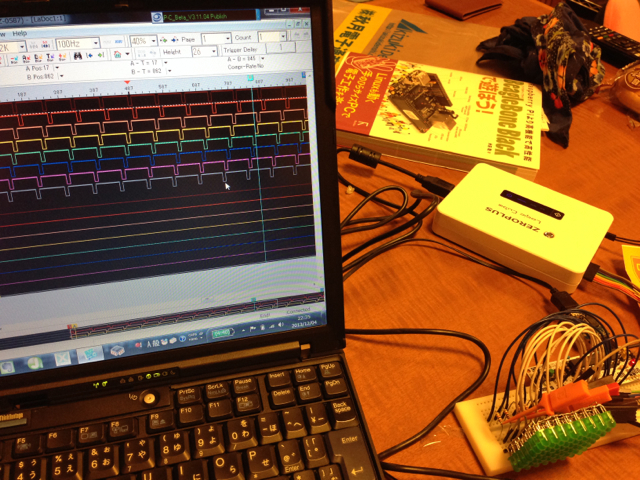
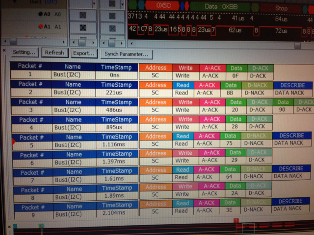

消費税があがるらしいので、秋月電子で売っている[ロジアナZEROPLUS](http://akizukidenshi.com/catalog/g/gM-04426/ "ZEROPLUS")を買ってきました。

早速この前作成した[空中配線LEDマトリクス表示回路](https://kanpapa.com/2013/11/ledonboard.html "空中配線マトリクスLEDをOnBoardで動かしてみた")に接続してみました。

初めてロジアナを使いましたが、PCで動くので操作性は良いですね。適当にいじっていたら計測できます。

LEDマトリクスの動作タイミングも良く分かりますね。

どうせならプロトコルも見たいなと先日購入した[8PDIP ARM LPC810](http://akizukidenshi.com/catalog/g/gI-07191/ "ＬＰＣマイコン　ＬＰＣ８１０Ｍ０２１")と[気圧センサーLPS331AP](http://akizukidenshi.com/catalog/g/gM-06581/ "ＬＰＳ３３１使用　高精度大気圧センサーモジュー")を接続し、LPCXpressoでI2C通信のプログラムを適当に書いてその様子を見てみました。

ロジアナでI2Cの設定をして見てみるとI2Cのプロトコルが表示されました。

この写真はLPS331APとの最初の通信を解析したところです。

0x5CのデバイスLPS331APに対して、WHO\_AM\_I(0x0F)のコマンドを送ると応答として0xBBが返ってきているのが分かります。

別の表示方法もできます。

いやあ実に素晴らしいです。もっと早く買っておけば良かったです。
