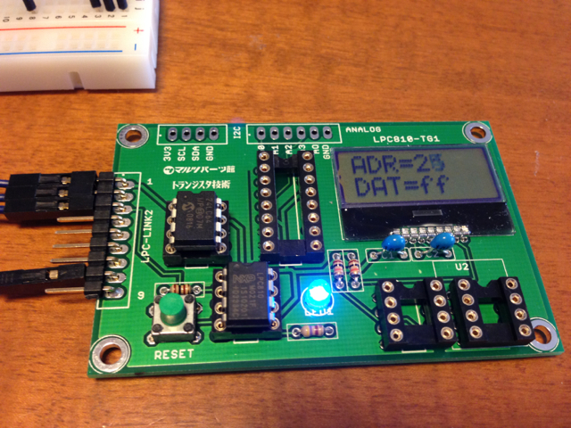

2014年2月号のトランジスタ技術の付録はNXP LPC810マイコンと実験用プリント基板とCD-ROMです。  
すでにLPC810は秋月で何個か購入して動かしたこともあるのですが、本誌にいろんな応用例が載っているようなので購入しました。  
付録として実験用プリント基板がついてきましたので、手持ちの部品で可能な限り実装してみました。  
LPC810マイコンの書き込みは、LPCXpresso LPC1768のLPC-Linkを使いました。（LPC-Linkにピンヘッダを取り付け済み）  
取り急ぎLPCXpressoのサンプルプログラムのblinkをベースに、実験用基板でLEDが接続されているポートに書き換えてコンパイル後にLPC-Link経由でLPC810に書き込み、LEDが点滅することを確認しました。  

次にEEPROMの書き込み、読み出しです。こちらも問題ありません。  

次に温度センサーと大気圧センサーですが、こちらは手持ちの秋月のモジュールを使いました。  
でも、実験用基板のピン配置はマルツのモジュール用なので、そのまま取り付けることはできません。  
そのためセンサーモジュール取り付け用のICソケットからワイヤーを引き出してブレッドボード上のセンサーモジュールに接続しました。  

問題なく動きますが、あまりかっこ良くありません。  
マルツのセンサーモジュールを持っていないのであれば、ICソケットは取り付けずに実験用基板に引き出されているI2Cの端子を使うのが良さそうです。  
もっともこのぐらいの規模であればブレッドボードで済んでしまうので、あまりこの基板のメリットは見当たりません。  
しいて言えばI2C LCDがそのままハンダ付けできる点ぐらいでしょう。  
でも初心者のかたには役に立つツールになるのではと思います。  
来月号はLPC-Link2のようなものが付録になるようですが、LPC-Link2も持っていますので・・・。
