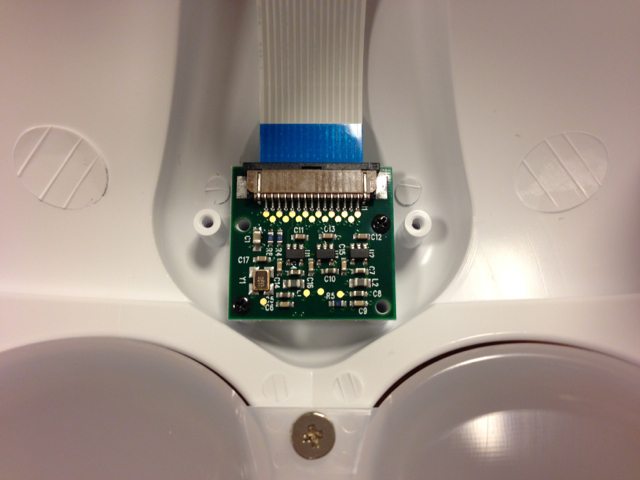
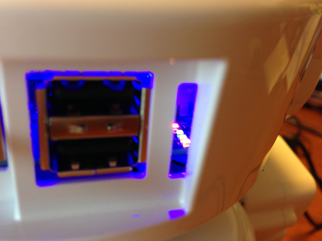

RAPIROにRaspberry Piのカメラモジュールを取り付けました。

頭の中に取り付けますが、力がかかる部分ではないので、とりあえず２本のネジだけで固定しています。

カメラレンズの穴と、カメラモジュール基板のネジ穴が一致するためにはフレキシブルケーブルを上にして取り付けます。このケーブルの片端はRaspberry PiのHDMIとLANコネクタの間にあるコネクタにとりつけます。Raspberry Piへの接続方法や設定方法、カメラ関連ソフトウェアのインストールなどはRaspberry Piの[Cameraページ](http://www.raspberrypi.org/camera "Raspberry Pi Camera")が参考になります。

早速、Raspberry Piにログインして、カメラで画像を撮ってみました。

コマンドは以下のようになります。

**pi@raspberrypi** **~ $** raspistill -w 640 -h 480 -o capture.jpeg

撮影したcapture.jpegをMacに転送して表示したところ・・・

  

あれれ、逆さまになってしまいました。カメラモジュールの取り付け方を間違えたのかなと一瞬思いましたが、ネジ穴の位置から考えるとあの取り付け方しかできません。

何らかの方法で上下を反転させれば良いはずなので、いろいろ調べたところ、それを行うためのパラメタを見つけました。

\-rot Set image rotation (0-359)

このパラメタを180と指定すれば上下反転されるはずなので、以下のコマンドを入力しました。

**pi@raspberrypi** **~ $** raspistill -w 640 -h 480 -rot 180 -o capture1.jpeg

撮影したcapture1.jpegをMacに転送して表示したところ・・・

今度は正常に表示できました。

別コマンドになりますが、もちろんビデオ撮影もできています。

単なるストリーミングという使い方もできますが、いずれは画像認識を試してみたいですね。（残念ながらこのあたりのノウハウはありませんので、これから勉強ですが・・・。）

あと、いろいろRAPIROをいじっていたらふと気がつきました。

このUSBコネクタの横にある、縦のスリットは何なのかと思っていたのですが、実はここからRaspberry Piの基板にあるLEDが良く見えるのです。このためにスリットを用意しているのではないかなと。良く考えられていると感心しました。
