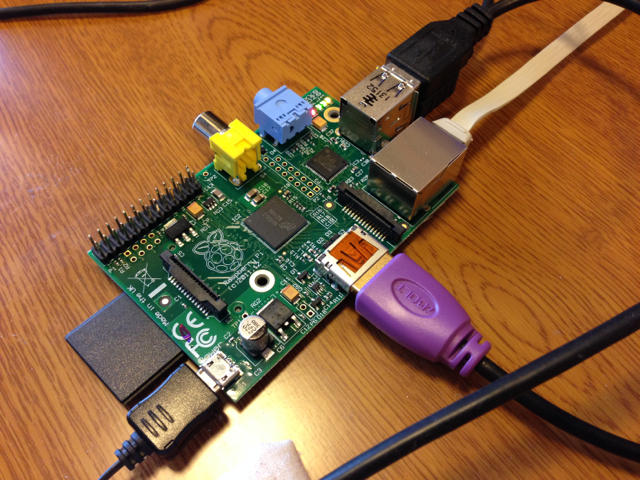
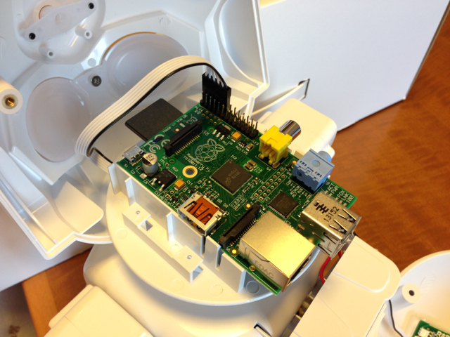
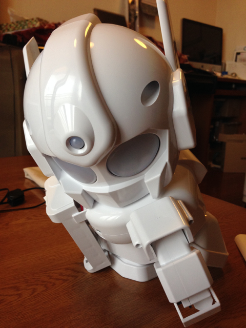
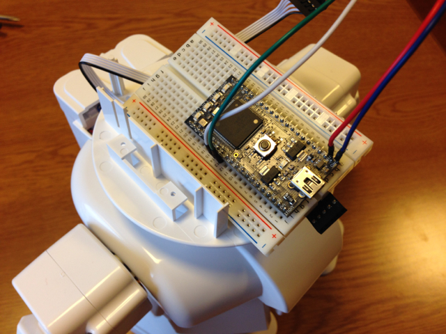

RAPIROが完成してRaspberry Piを載せてみました。

まずは、Raspberry Piの環境設定です。ボード単体で動かしてPythonのシリアルモジュールのインストールや無線LANドングルの設定など一通り済ませました。



設定が終わったところで、RAPIROに取り付けます。さすが専用設計のためRaspberry Piがピッタリ載ります。



あとは、Raspberry PiにログインしてPythonで書いたサンプルプログラムを実行するとコマンドに応じた動きをすることができました。カメラモジュールも購入していますが、それはまた後ほど。

少し動かしてみましたが、想像以上にバッテリーが無くなります。デバックにはACアダプタが必須と思われます。電源電圧がだんだん落ちてきてRAPIROが変な動きになってしまいました。



やむなくエネループを充電している間に、Raspberry Piの変わりにmbedをつないでみました。

実はRAPIROの電源をいれたあとに、Raspberry PiのLinux OSの起動に少し時間がかかるのが気になったのです。これがmbedだと電源ON即動くのではと考えたのです。

Raspberry PiとRAPIROのサーボモータを制御しているArduinoとの間の通信はシリアルですので、他のマイコンでも制御可能です。通信速度は57600bpsのようです。

mbedをブレッドボードに取り付けてワイヤーを引き出し、RAPIROのシリアルコネクターに接続しました。接続図は以下の通りです。

```
RAPIROシリアル --- mbed
---------------------------
1  5V ------- p2　VIN
2
3  GND ------ p1　GND
4  TXD ------ p28 tx
5  RXD ------ p27 rx
6 (BLACK)
---------------------------
```

実際に接続した写真です。接続は４本しかありません。



mbedのオンラインコンパイラでさくっと[プログラム](https://mbed.org/users/kanpapa/code/rapiro_test1/ "RAPIROのテストプログラム")を書きました。

RAPIROの電源を入れると無事動き始めました。


動いている様子をYouTubeにアップしておきました。



今回は単純なコマンドをRAPIROに送ることを試しましたが、Bluetoothでリモコン制御にしたり、様々なセンサーを使った制御などmbedが得意とする分野では手軽に使えるのではないかと思います。
