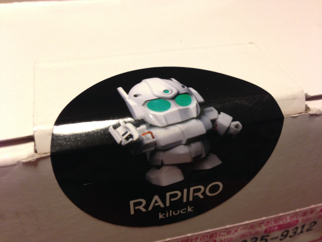
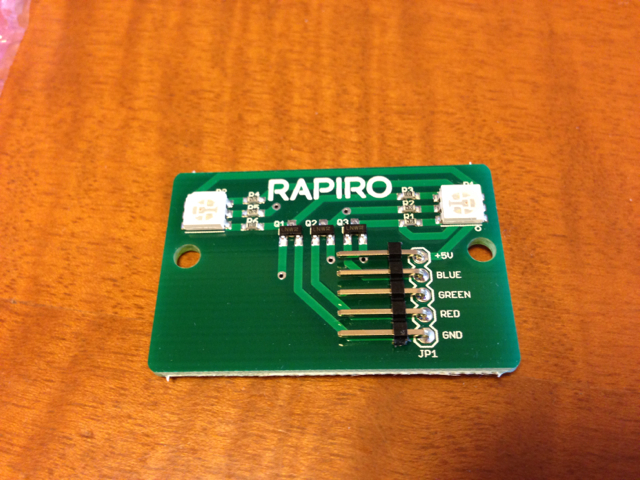
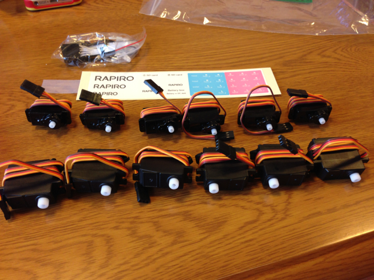
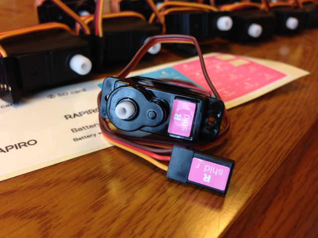

[Kickstarter](https://www.kickstarter.com/projects/shota/rapiro-the-humanoid-robot-kit-for-your-raspberry-p "kickstarter.com")で購入していた[RAPIRO](http://www.rapiro.com "rapiro.com")が到着しました。2月からは[スイッチサイエンスさん](http://www.switch-science.com "switch-science.com")で一般販売されるようです。

到着した箱はこんな感じです。シンプルです。

封印シールがRAPIROになっています。

箱を空けると部品がでてきました。部品は破損しないようにプラスチックの枠にはめられています。

細かい部品はビニール袋に入っています。

Arduino互換のサーボモーターの制御基板はこんな感じです。

こちらは顔のLED基板でしょうか。

一通りの部品を確認したところで、組み立て開始です。

まずはサーボモーターに目印のシールをはります。これをやっておかないとどのケーブルがどのサーボモーターなのか分からなくなってしまいます。サーボモーターは大６個、小６個の合計１２個です。

１個１個貼っていきます。

すべてのモーターにシール張りが完了しました。

次に電池ボックスを組み立てます。

エネループ単3が5本ですので、6Vの電源になります。

次に電池ボックスとサーボモーターを制御基板に取り付けます。こんな数のモーターを同時に制御するのは初めてです。

ここで電源を入れてサーボモーターを初期値にします。

サーボモーターが一斉に動きます。その様子をYouTubeにアップしておきました。

あとは組み立てマニュアルに従って組み立てていきます。この様子はVineでお楽しみください。

組み立て自体は難しいところはありません。[組み立てマニュアル](https://plus.google.com/photos/+ShotaIshiwatari/albums/5975815890170562785 "RAPIRO組み立てマニュアル")に詳細な写真が載っていますので、その通り行えば大丈夫です。ただしタッピングビスなので締め過ぎ無いように注意してください。

組み立てが完了したら動かします。

まずはArduino IDEを使って制御基板にスケッチを書き込みます。この基板はArduino Unoとして認識できます。私のMacBookAirではFTDIドライバをインストールして認識することができました。

サーボモーターの調整方法についても組み立てマニュアルにあるのでそちらを参考にしてください。

まだ完全には調整できていないのですが、とりあえず動かしてみました。Arduino IDEのシリアルモニタの画面からコマンドを入力します。私の場合は57600bpsで行いました。サンプルとして、#M0, #M1.....,#M8などのコマンドが準備されていてそれぞれプログラムされた動きをしてくれます。

まだこの状態ですと、RAPIROのサーボモーターをコマンド文字列で制御することしかできません。頭脳になるRaspberry Piを載せてプログラムすることでもっと複雑な動作やネットワークにつないだりということができるようになります。こちらは今後試していきます。

以前、mbedでも同様な仕組みで[m3pi](http://mbed.org/users/kanpapa/notebook/m3pi/ "m3pi")というライントレーサーロボットを動かしたことがありますので、Raspberry Pi以外のマイコンを載せるのも面白いかなと思います。
