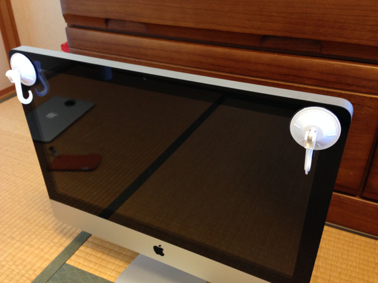
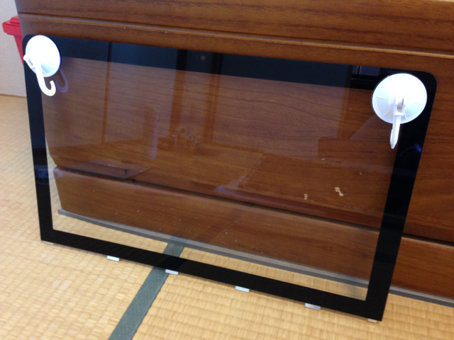
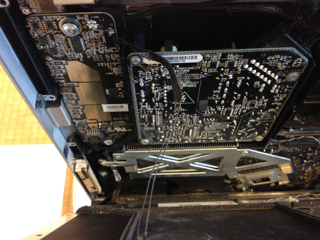

[iMacのDVDドライブをSSDに交換してみた（準備編）](https://kanpapa.com/2014/06/imac-dvd2ssd.html "準備編")からの続きです。

**iMacの分解はリスクもありますので自己責任でお願いします。**

材料が揃ったところでiMacを分解する必要があります。

分解の方法は[ASCII.jpの記事](http://ascii.jp/elem/000/000/407/407309/ "素人「絶対」お断り！　新iMacのHDD交換方法")を参考にしました。少し古いですが基本構造は同じと思います。

まずは正面のアクリル板を外します。吸盤を隅に取り付けて引っぱると上側に隙間ができます。

その隙間を利用して慎重にアクリル板を外すと液晶画面が現れます。

外したアクリル板はほこりがつかないように立てかけておきましょう。

次に傷がつかないようにバスタオルとかを敷いて、そこにiMacを寝かせます。

液晶画面ユニットはT-8のネジで固定されていますのでそれを外します。ネジの近くに強力な磁石があるのでネジやドライバーがくっつきやすいです。ピンセットなどでネジを固定しながら作業することをおすすめします。

外したネジはどの位置のネジかわかるように記録しておきましょう。私はこんな感じで図の上に置くようにしています。

ネジを外すと液晶画面が動くようになります。

この状態で再びiMacを慎重に縦置きにして、液晶画面を少しずつ前に倒すと接続ケーブルが何本か見えますので、これを慎重に外します。

左側に２本。

真ん中に２本。

左側の２本のケーブルと真ん中のフラットケーブルでないケーブルを１本外したところで、そのまま液晶画面を９０度縦向きにすることができました。この状態でDVDドライブにアクセスできますので、真ん中のケーブル２本は外さなくてもよいかもしれません。（未確認）

ちなみに内部は相当ほこりがたまっていましたので、エアダスターで吹き飛ばしつつ掃除機で吸い取りました。

あと不注意にも液晶画面を触ってしまい、少し指紋がついてしまいました。これはあとでなんとかすることにしましょう。

このあと[iMacのDVDドライブをSSDに交換してみた（換装編）](https://kanpapa.com/2014/06/imac-dvd2ssd-3.html "換装編")に進みます。
