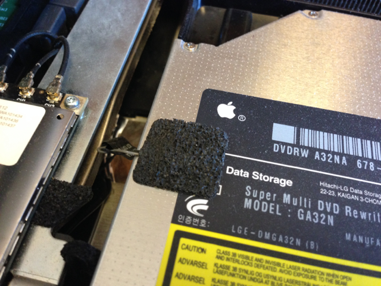
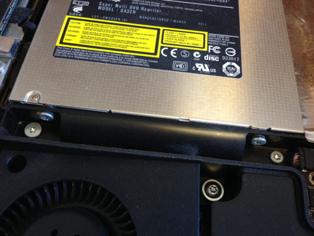
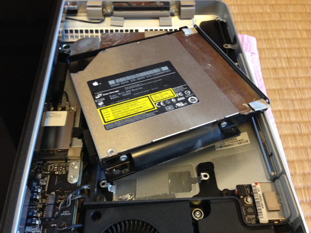
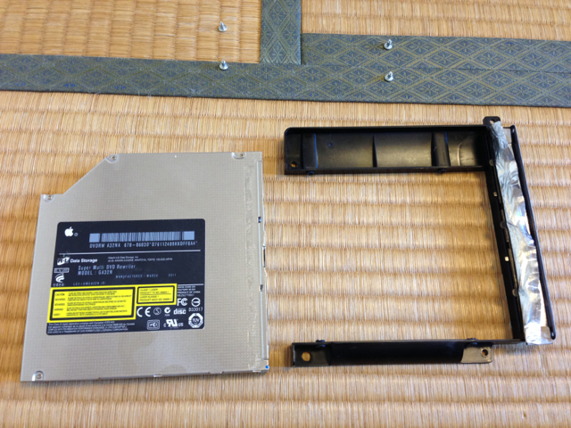
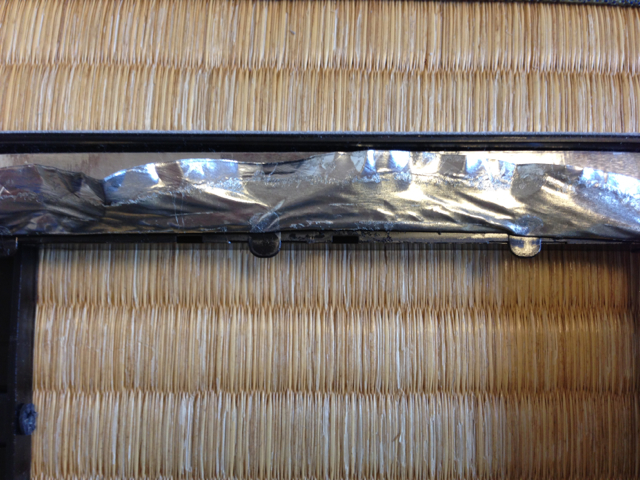
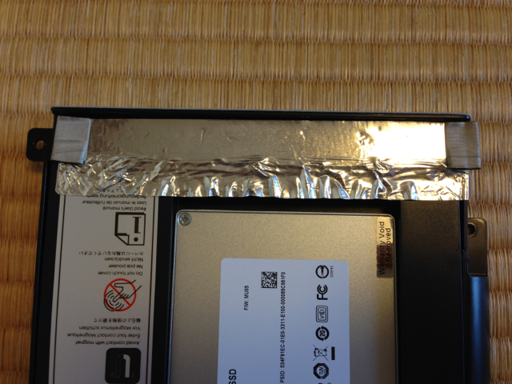

[iMacのDVDドライブをSSDに交換してみた（分解編）](https://kanpapa.com/2014/06/imac-dvd2ssd-2.html "分解編")からの続きです。

**iMacの分解はリスクもありますので自己責任でお願いします。**

DVDドライブを観察すると、温度センサーらしきものが張り付いています。

ゆっくり保護シールを剥ぐと基板が見えます。慎重に基板本体も剥いでいきます。

次にDVDドライブを固定しているユニットの４本のT-8ネジを外します。

ここに２カ所

さらに２カ所あります。

４本のネジを外すとDVDユニットが外れます。

外したDVDユニットはこんな感じです。

DVDドライブを取り外すために、電磁シールドのアルミシールを剥がします。

DVDドライブを固定している４本のネジを外すと、DVDドライブが取り外せます。

ここでDVDドライブをSSDドライブに交換できるキットの出番です。

まずキットにSSDをとりつけます。これでSSDドライブの大きさと接続コネクタがDVDドライブと同じになります。

先ほどのプラスチックの枠にSSDドライブ交換キットを取り付けます。

ここで１つ問題があり、プラスチックの枠に２つほど小さな爪がでていて、それが邪魔になります。

私の場合は、この２つの爪はニッパーで折ってしまいました。もうDVDを載せることはないでしょうから。

DVDドライブを取り付ける要領で、SSDドライブを取り付けます。剥がしたアルミシールをもとに戻します。

DVDユニットをiMac本体に取り付けて、T-8ネジで固定します。温度センサーもSSDのケースにくっつけます。

これでDVDからSSDへの交換が終わりました。

このあと[iMacのDVDドライブをSSDに交換してみた（組立編）](https://kanpapa.com/2014/06/imac-dvd2ssd-4.html "組立編")に進みます。
