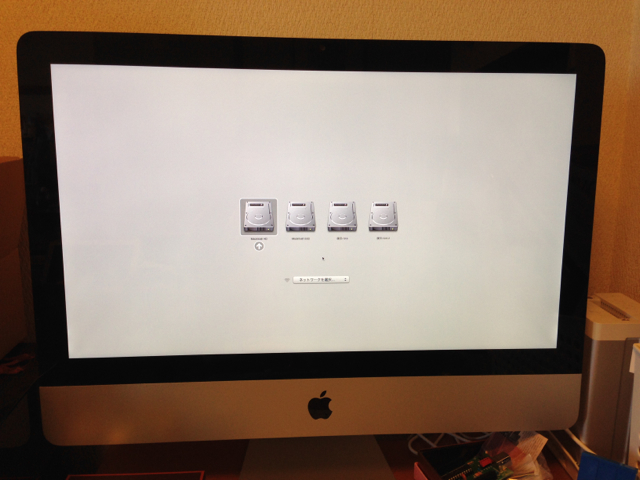

[iMacのDVDドライブをSSDに交換してみた（換装編）](https://kanpapa.com/2014/06/imac-dvd2ssd-3.html "換装編")からの続きです。

**iMacの分解はリスクもありますので自己責任でお願いします。**

SSDドライブへの交換が完了しましたので、iMacを組み立てていきます。分解と逆の手順で進めていきます。

９０度縦にしている液晶画面パネルを元の位置に戻します。このとき不用意にケーブルを引っ張ったりせず、指紋を液晶画面パネルにつけないように注意して作業します。

縦置きにした状態で、ケーブルを元通りに取り付けていきます。

左側は２本

  

中央も２本

  

ケーブルの取り付けが完了したら、液晶画面パネルを元の位置に戻して、静かに本体を倒します。

  

液晶画面パネルを固定していた８本のT-8ネジを締めて固定します。

液晶画面に指紋がついてしまった場合はここで丁寧に拭き取ります。私の場合はiPhoneの液晶画面保護シートを貼るときに使ったクリーニングクロスを使いました。

次に外してあったアクリル板を取り付けます。強力な磁力で本体とくっつきますので位置決めに注意しながら正しい位置で固定します。

  

いよいよ電源投入です。４つのドライブが表示されました。SSDはあらかじめiMacにUSBで接続してMacOS Xをインストール済ですのでこのように認識します。

SSDを選んで起動してみます。

速い！これまでとは比べ物にならないスピードで起動しました。

無事SSD交換完了です。あとはTRIMの設定と環境設定の移行を進めて終了です。

iMacの旧起動ディスクである内蔵の500GBにはiPhotoのライブラリを置くことにし、それ以外はすべてSSDに移行しました。

起動ディスクになったSSDはTime Capsuleで自動バックアップされますが、iPhotoライブラリが入った旧起動ディスクはバックアップされないので、その点は工夫しないといけません。定期的にバックアップするための外付けHDDを接続して対応することにしました。標準機能でバックアップできるとよいのですが。

ちなみにこの作業で我が家のWindows PCとMacはすべてSSD実装済となりました。
