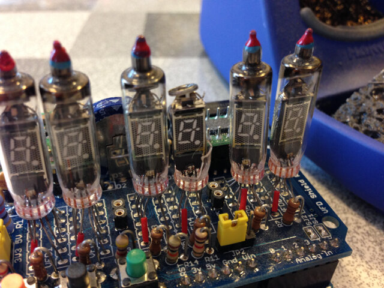
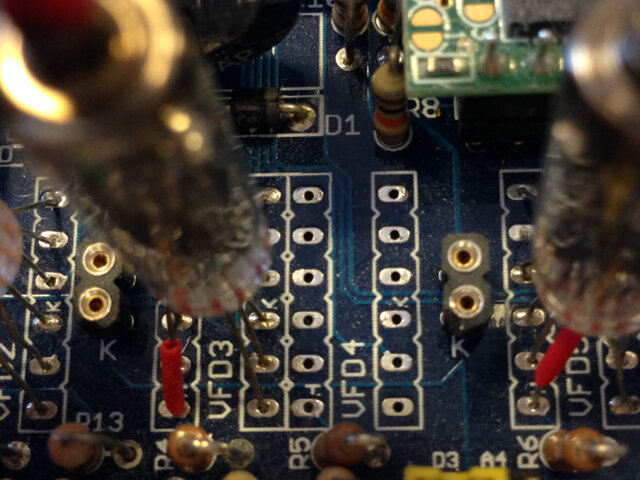
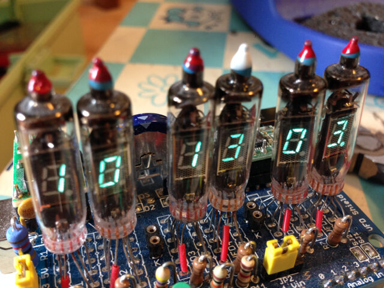

以前製作したVFDシールドを落っことしてしまいまして、VFD（蛍光表示管）が１つ割れてしまいました。

危険なので割れたVFDを取り外します。リード線を切断して取り外したのちに、はんだシュッ太郎でハンダを除去しました。

デジットさんにVFDを注文して到着しました。

さっそく取り付けます。こんな感じかな。

VFDシールドの修理完了です。無事点灯しました。

VFDのスペアを買っておいたのでまた割れても大丈夫かな。
