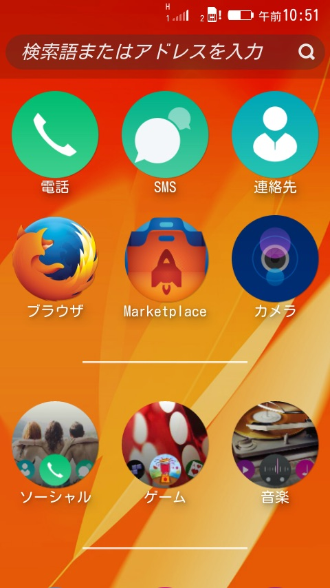

Firefox OS Flameを手に入れました。でも、購入時点だとFirefox OS 1.3で日本語画面ではありませんでした。

[Flameのページ](https://developer.mozilla.org/ja/Firefox_OS/Developer_phone_guide/Flame "MDN Flame")にNightly build (Firefox OS 2.1)がリンクされていましたので、これと入れ替えてみました。

私はMacBook Airを使っていますので、[adb-fastboot-install](https://code.google.com/p/adb-fastboot-install/ "adb-fastboot-install")をインストールしてadbやfastbootが動く状態にしています。

以下の[３つの必要なファイル](http://ftp.mozilla.org/pub/mozilla.org/b2g/nightly/latest-mozilla-central-flame-eng/ "nightly build")をMacにダウンロードして、適当なフォルダにいれておきます。

- b2g-34.0a1.en-US.android-arm.tar.gz　（ファイル名はその都度変わります）
- gaia.zip
- shallow\_flash.sh

作業の前にFlameの環境設定でリモートデバッグを有効にしておくことと、途中で端末ロックがかからないように画面ロックを無効にしておきます。

Macのターミナルを立ち上げて、先ほどのフォルダに移動します。

```
$ cd ~/Desktop/Flame

```

実行権限をつけます。

```
$ chmod +x ./shallow_flash.sh

```

書き込みのスクリプトを実行します。

```
$ ./shallow_flash.sh -g gaia.zip -G b2g-34.0a1.en-US.android-arm.tar.gz
Are you sure you want to flash
Gaia: gaia.zip
Gecko: b2g-34.0a1.en-US.android-arm.tar.gz
to your Device? [y/N]y　←Yと入力。
### Waiting for device... please ensure it is connected, switched on and remote debugging is enabled in Gaia
### Restarting adb with root permissions...
adbd is already running as root
### Remounting the /system partition...
remount succeeded
### Stopping b2g process...
### Processing Gaia: gaia.zip
### Unzip gaia.zip to /var/folders/83/rk2h8hb12fs8ft2v0f68zyqm0000gn/T/shallowflashgaia.XXXXXXXXXXXX.CorEeLCJ ...
### Cleaning Gaia and Profiles ...
rm failed for /data/local/svoperapps, No such file or directory
rm failed for /data/local/user.js, No such file or directory
rm failed for /data/local/indexedDB, No such file or directory
### Cleaning Done.
### Pushing Gaia to device ...
push: /var/folders/83/rk2h8hb12fs8ft2v0f68zyqm0000gn/T/shallowflashgaia.XXXXXXXXXXXX.CorEeLCJ/gaia/profile/webapps/bluetooth.gaiamobile.org/manifest.webapp -> /system/b2g/webapps/bluetooth.gaiamobile.org/manifest.webapp
push: /var/folders/83/rk2h8hb12fs8ft2v0f68zyqm0000gn/T/shallowflashgaia.XXXXXXXXXXXX.CorEeLCJ/gaia/profile/webapps/bluetooth.gaiamobile.org/application.zip -> /system/b2g/webapps/bluetooth.gaiamobile.org/application.zip
：
：（中略）
：
push: /var/folders/83/rk2h8hb12fs8ft2v0f68zyqm0000gn/T/shallowflashgecko.XXXXXXXXXXXX.sH1PJPqC/b2g/b2g -> /system/b2g/b2g
push: /var/folders/83/rk2h8hb12fs8ft2v0f68zyqm0000gn/T/shallowflashgecko.XXXXXXXXXXXX.sH1PJPqC/b2g/application.ini -> /system/b2g/application.ini
24 files pushed. 0 files skipped.
3746 KB/s (38943826 bytes in 10.151s)
### Push Done.
error: protocol fault (no status)　←エラーのようですが問題なさそうです。
### Shallow Flash Successful!
$

```

これで、リブートするとFirefox OS 2.1が立ち上がります。

環境設定で確認すると2.1.0.0-prereleaseとなっていました。

初期設定で日本語が選択できますので、それを選択するとホーム画面や各種表示が日本語になります。

残念ながら日本語IMEは組み込まれていないので、自分でビルドするしかありませんが、手っ取り早く最新の環境を使ってみるのも面白いのではと思います。

なお、すでに公開されている[APNパッチとFMラジオパッチ](https://github.com/dynamis/firefoxos-patch "APNパッチとFMラジオパッチ")はそのまま使えました。

ホーム画面のスクリーンショットを撮ってみましたが、Firefox OS 2.1では音量を下げるボタンとホームボタンの同時押しに変更になっています。


