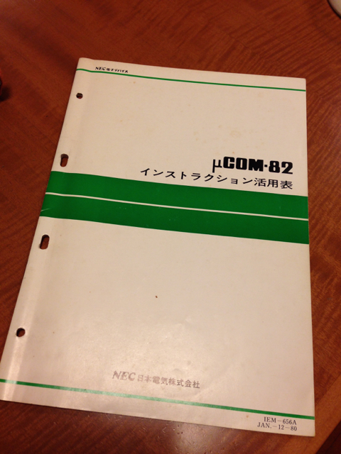

前回CTF予選に初参加しましたが、面白かったので今回のCTF予選にも参加してみました。

解いた問題は以下の７つの100点問題です。合計で700点獲得できました。

- Welcome to SECCON（Start）

- Easy Cipher（Crypto）

- Shuffle（Binary）

- Reverse it（Binary）

- Get the key.txt（Forensics）

- Choose the number（Programming）

- Get the key（Network）

200点問題にもチャレンジしてみましたが、こちらは途中で時間切れとなってしまいました。

今回もCTF初心者ならではの100点問題ばかりのWrite-upを書いてみました。

## **Welcome to SECCON（Start）**

いつもの練習用の問題で、単純にFlagを入力するだけです。

## **Easy Cipher（Crypto）**

問題には以下のような数字の羅列が書かれていました。

```
87 101 108 1100011 0157 6d 0145 040 116 0157 100000 0164 104 1100101 32 0123 69 .....
```

規則性がみられます。"1100011"などの7桁の数字は0と1しかありません。これは２進数でしょう。 "0145"とか"0157"の４桁の数字は、7を超える数字がありません。また頭に0がついていて、８進数の書き方に見えます。これは８進数と想定しました。 "6d" とかはこれは16進数ですね。これ以外の数字は10進数と想定しました。

このルールで数字を全部16進数に変換して、バイナリエディタに入力しました。

```
1010011 0105 0103 67 79 1001110 123 87 110011 110001 67 110000 1001101 32 55 06053
53      45   43  43  4f 4e      7b  57 33     31     43 30     4d      20 37 30
S       E    C    C  O  N       {   W  3      1      C  0      M          7  0
100000 110111 0110 110011 32 53 51 0103 0103 060 0116 040 5a 0117 73 0101 7d
20     37     48   33     20 35 33 43   43   30  4e   20  5a 4f   49 41   7d
7      H    3         5  3  C    C    0   N        Z  O    I  A    }

```

最後のあたりにフラグがありました。

## **Shuffle**（Binary）****

提供されたファイルをLinuxのfileコマンドで確認しました。

```
$ file shuffle
shuffle: ELF 32-bit LSB executable, Intel 80386, version 1 (SYSV), dynamically linked (uses shared libs), for GNU/Linux 2.6.24, not stripped
$
```

86系の実行ファイルのようです。Linux上で実行するとランダムな文字列が出力されました。 この文字の出力からでは何もわかりませんでしたので、まずはバイナリエディタでそれらしき文字列がないかを確認しましたが、フラグはありませんでした。

次に、IDAという逆アセンブラで実行ファイルを解析してみたところ、以下のような怪しい部分がみつかりました。

```
.text:0804854B                 mov     eax, 53h
.text:08048550                 mov     [esp+24h], al
.text:08048554                 mov     eax, 45h
.text:08048559                 mov     [esp+25h], al
.text:0804855D                 mov     eax, 43h
.text:08048562                 mov     [esp+26h], al
.text:08048566                 mov     eax, 43h
.text:0804856B                 mov     [esp+27h], al
.text:0804856F                 mov     eax, 4Fh
.text:08048574                 mov     [esp+28h], al
:（延々と続く）
.text:08048694                 mov     [esp+48h], al
.text:08048698                 mov     eax, 21h
.text:0804869D                 mov     [esp+49h], al
.text:080486A1                 mov     eax, 7Dh
.text:080486A6                 mov     [esp+4Ah], al
.text:080486AA                 mov     eax, 0
.text:080486AF                 mov     [esp+4Bh], al

```

これは明らかに文字列を１文字ずつ扱うことで隠そうとしている節があります。

代入している数値をバイナリエディタに入力したところ、フラグがでてきました。

## **Reverse it**（Binary）****

まずはfileコマンドで確認

```
$ file Reverseit
Reverseit: data

```

単なるデータのようです。

次にバイナリエディターでダンプしたところ、"02"という数字が多く並んでいるのが気になりました。

問題はReverse itですから、何かを反転させる必要がありそうです。ふと思いついたのですが、"02"の上位と下位の桁を入れ替えると"20"になります。"20"はご存知の通り空白の文字コードです。もしも空白ということであれば、その開始と終了のあたりのデータを同じように入れ替えると文字列が現れるはずです。

これを試したところ、XMLぽいコードがでてきましたが、逆向きに読めました。

これらの結果から各バイトの上位桁と下位桁を入れ替えたあとに、データの最後から最初に向けて並べ替えるプログラムをPythonでかきました。

https://github.com/kanpapa/ctf/blob/master/reverse\_it.py

変換後のファイルをバイナリエディタで覗いたところ、JFIFという文字が見えました。

これはJPEGファイルではないかということで、念のためファイルコマンドでも確認しました。

```
$ file Reverse.jpg
Reverse.jpg: JPEG image data, JFIF standard 1.01

```

拡張子を.jpgに変換してビューワーでみたところ、こんな画像がでてきました。


ご丁寧に文字の画像も反転していますので、反転して読むことでフラグが取れました

## **Get the key.txt（Forensics）**

まずはいつものようにfileコマンドです。

```
$ file forensic100
forensic100: Linux rev 1.0 ext2 filesystem data
$

```

Linuxのext2ファイルシステムのようです。

念のためdumpe2fsコマンドで確認したところ、間違いないようです。

```
$ dumpe2fs forensic100

```

ファイルシステムとしてマウントしてみます。

```
$ mkdir mnt3
$ mount forensic100 mnt3
$ cd mnt3
$ ls -l : :
```

マウントできましたが、数字のファイルがたくさんでてきました。

fileコマンドで確認するとgzipファイルでしたので、試しに１つ解凍してみると、フラグが書かれていました。

しかし、すべてのファイルにフラグが書かれているようです。これではどれが本物かわかりません。

fileコマンドの結果をよく見たところ、key.txtと書かれたものがありました。これが本物のフラグでした。

## **Choose the number（Programming）**

指定されたサーバにアクセスすると以下のようなものでした。

```
$ nc number.quals.seccon.jp 31337
4, 7
The minimum number?
Timeout, bye.
$ nc number.quals.seccon.jp 31337
-9, 5
The maximum number? 5
8, -9, 7
The minimum number? -9
-5, -7, -8, -4
The minimum number? -8
6, 0, 0, 1, 4
The maximum number?
Wrong, bye.
$

```

この調子でずっと繰り返すようです。人力では最後まで辿りつけそうもありません。

自動的に回答するプログラムをPythonで作成しました。

https://github.com/kanpapa/ctf/blob/master/choose\_the\_number.py

試してみると100回めでフラグが取れました。

```
$ python choose_the_number.py
0recvstr: -4, -7
The minimum number?
line1: -4, -7
line2: The minimum number?
strlist: ['-4', ' -7']
numlist: [-4, -7]
numlist(sort): [-7, -4]
sendstr: -7
1
recvstr: 4, 0
The maximum number?
line1: 4, 0
line2: The maximum number?
strlist: ['4', ' 0']
：
：
3231051924, 3238681159, 3338114506, 3402677356, 3425438800, 3448293469, 3573163659, 3649031632, 3662187780, 3812908271, 3816985767, 3846435394, 3982641142, 4085727022, 4156598984, 4201589254, 4277411618]
sendstr: -4177468994
recvstr: Congratulations!
recvstr: The flag is SECCON{Programming is so fun!}

```

## **Get the key（Network）**

pcapファイルが添付されていましたので、Wiresharkに読み込みました。

BASIC認証を挟んだWebアクセスの通信ログのようです。まずは、HTTPで扱ってるファイルを抽出しました。（Export Object->HTTP）

この結果２つのHTMLファイルがでてきました。１つはAuthorization Requiredのエラー画面。もう１つはkey.htmlというファイルがダウンロードできる画面です。

この画面が見えているということは、ログにID/PWが残っているはずです。

そこで、このダウンロード画面が流れている部分のAuthorization:ヘッダにBASIC認証のIDとPasswordがあるはずなので確認したところ、WiresharkでデコードされたIDとPWがありました。

実際のサイトに接続してこのID/PWを入力することで、key.htmlを入手しフラグが取れました。

時間内に回答できたのは以上の７問になります。

あと面白そうな問題として以下の200点問題に取り組みました。

## **Let's disassemble**（Binary）****

指定されたサーバにアクセスすると以下のようなものでした。

```
$ nc disassemble.quals.seccon.jp 23168
#1 : F9
?
Timeout, bye.
$
```

このコードを逆アセンブルしろということでしょうか。

どんな機械語がでてくるのか適当に何回も叩いてみました。

```
$ nc disassemble.quals.seccon.jp 23168
#1 : 83
?
Something wrong, bye.
$ nc disassemble.quals.seccon.jp 23168
#1 : 36 14
?
Something wrong, bye.
$ nc disassemble.quals.seccon.jp 23168
#1 : CC 7B 27
?
Something wrong, bye.
$ nc disassemble.quals.seccon.jp 23168
#1 : 82
?
Something wrong, bye.
$ nc disassemble.quals.seccon.jp 23168
#1 : 14
?
Something wrong, bye.
$ nc disassemble.quals.seccon.jp 23168
#1 : 2A 56 98
?
Something wrong, bye.
$

```

どこか見覚えのあるような機械語です。なんとなく8ビットCPUのように思えます。

そこでものは試しとZ80の機械語表を取り出して、ハンド逆アセンブルをしてみました。



```
$ nc disassemble.quals.seccon.jp 23168
#1 : 6D
? LD L,L
#2 : A3
? AND E
#3 : C1
? POP BC
#4 : 96
? SUB (HL)
#5 : 39
? ADD HL,SP
#6 : B4
? OR H
#7 : 17
? RLA
#8 : 6E
? LD L,(HL)
#9 : 71
? LD (HL),C
#10 : 6B
? LD L,E
#11 : DA 75 76
? JP C,
Timeout, bye.
$

```

最後の行は時間切れで入力できませんでしたが、どうやらZ80で良いようです。とはいえこれも自動入力しないとtimeoutで通信が切れてしまいます。

やむなく、Pythonで自動入力の逆アセンブラプログラムを作成しはじめました。この時点であと５時間です・・・。

最初は8080の命令の範囲だけの出題かなと思って試していましたが、Z80の拡張命令も出てきて大掛かりなものになってしまいました。

作りかけのプログラムは以下におきました。これは不完全なものですのでご注意ください。

https://github.com/kanpapa/ctf/blob/master/lets\_disassemble.py

途中まで実行を試した結果は以下のようになりました。いいところまでできたのですが。残念です。

```
$ python lets_disassemble.py
z80asm_len:  256
z80_ddasm_len:  256
z80_ddcbasm_len:  256
z80_fdcbasm_len:  256
0recvstr: #1 : A0
?
line1: #1 : A0
line2: ?
strlist: ['#1', ':', 'A0']
code_len: 1
code1: A0
code1_num: 160
code1_op: AND B
asm_code: AND B
sendstr: AND B
1
recvstr: #2 : F1
?
line1: #2 : F1
line2: ?
strlist: ['#2', ':', 'F1']
code_len: 1
code1: F1
code1_num: 241
code1_op: POP AF
asm_code: POP AF
sendstr: POP AF
:
:
66
recvstr: #67 : 48
?
line1: #67 : 48
line2: ?
strlist: ['#67', ':', '48']
code_len: 1
code1: 48
code1_num: 72
code1_op: LD C,B
asm_code: LD C,B
sendstr: LD C,B
67
recvstr: #68 : FD CB 9C D6
?
line1: #68 : FD CB 9C D6
line2: ?
strlist: ['#68', ':', 'FD', 'CB', '9C', 'D6']
code_len: 4
code4_num: 214
code4_op: SET 2,(IY+d)
asm_code: SET 2,(IY+9CH)
sendstr: SET 2,(IY+9CH)
68
recvstr: Something wrong, bye.
$

```

うーん。ちゃんと早朝から取り組めば間に合ったかもです。

でも、ここまでやって200点とはやはりチームでやらないと厳しいですね。

**【追記】せっかくここまでやったので、プログラムを仕上げました。**

dの値がマイナスがあることを忘れていて悩んでしまいました。修正点は[Github](https://github.com/kanpapa/ctf/blob/master/lets_disassemble.py "lets_disassemble.py")をご覧ください。

最終結果は以下の通りでフラグも取れました。

```
$ python lets_disassemble.py
z80asm_len:  256
z80_ddasm_len:  256
z80_ddcbasm_len:  256
z80_fdcbasm_len:  256
0recvstr: #1 : B0
?
line1: #1 : B0
line2: ?
strlist: ['#1', ':', 'B0']
code_len: 1
code1: B0
code1_num: 176
code1_op: OR B
asm_code: OR B
sendstr: OR B
1
recvstr: #2 : FA 74 2E
?
line1: #2 : FA 74 2E
line2: ?
strlist: ['#2', ':', 'FA', '74', '2E']
code_len: 3
code1: FA
:
:
code2_op: BIT 7,E
asm_code: BIT 7,E
sendstr: BIT 7,E
99
recvstr: #100 : CB 2F
?
line1: #100 : CB 2F
line2: ?
strlist: ['#100', ':', 'CB', '2F']
code_len: 2
code2_num: 47
code2_op: SRA A
asm_code: SRA A
sendstr: SRA A
recvstr: Congratulations!
recvstr: The flag is SECCON{I love Z80. How about you?}
recvstr:
recvstr:
recvstr:
recvstr:
$

```

## まとめ

今回はプログラムを作らないと解決できないところがあり初めてPythonを使ってみました。見るにたえないプログラムだと思いますが、こんなプログラムでも参考になればということでGithubに入れておきました。
