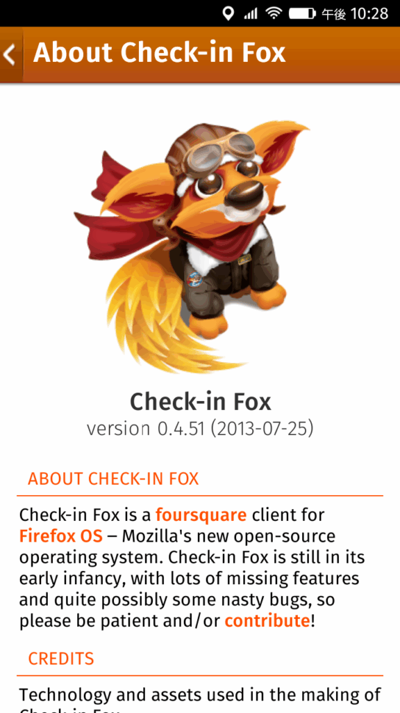
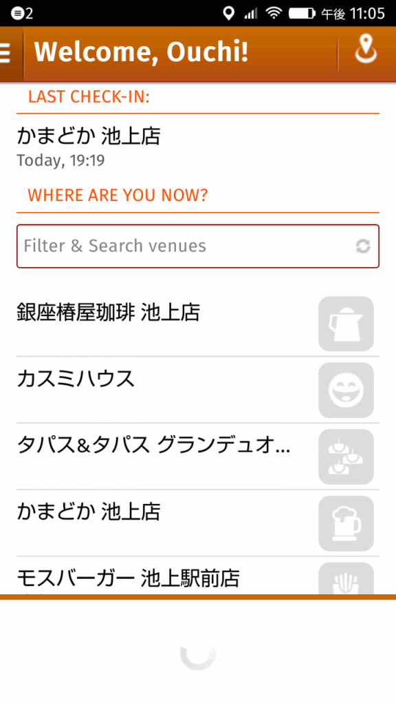

auから発売されたFirefox OS LGL25 Fx0を買ってしまいました。

すでにFlameを持っていますのでFirefox OSはどういう感じかは知っているのですが、auがどのようにチューニングをして、Firefox OSアプリを揃えてくるのかと興味がありました。現時点ではNAVITIMEで路線情報と地図をカバーし、LINEやFacebookやTwitterでSNSはカバーと最低限のアプリは揃えたようです。他にFraminやLockScreen、au災害対策といったオリジナルアプリも提供されています。あとカメラの画質が思っていたよりは良くてこの点は気に入っています。

私は天気の情報も知りたいので、天気・Rというアプリや、日常的に使っている電卓やコンパスやソリティア、QRコードリーダなどもFirefox Marketplaceからインストールし、これでまあまあ使えるかなという状態にはなりました。

あと、これまで使ってきたSwarmというFoursquereのチェックインアプリがないか探したのですが、Firefox OSはサポートしていないようです。類似のアプリをさがしたところCheck-in Foxというアプリを見つけました。（マスコットキャラクターが可愛いです！）

  

しかし古いアプリのようで、動作がやや不完全で、地図なども表示されないのですが、ちゃんと日本語でも表示されチェックインまではできます。

  

ソースはGitHubに公開されているので、Firefox WebIDEのデバッガをつかって確認してみましたが、すでにサービスが終了しているWebAPIを呼んでいたりして、修正が必要なようです。時間のあるときにソースを追って動くようにいじってみようかなと思っています。
