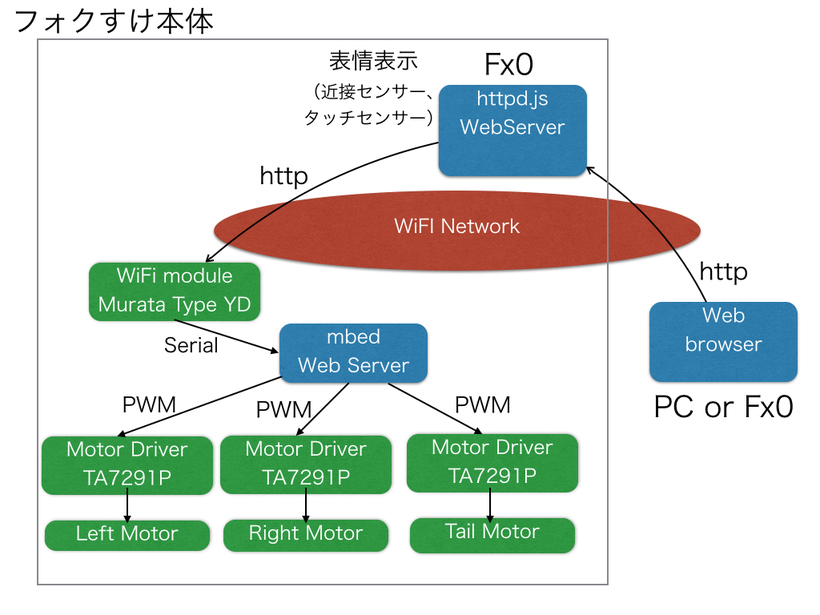
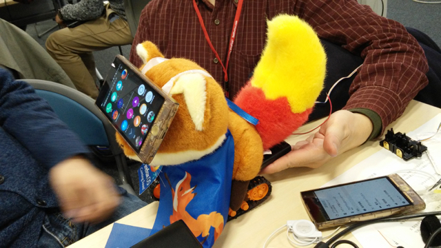
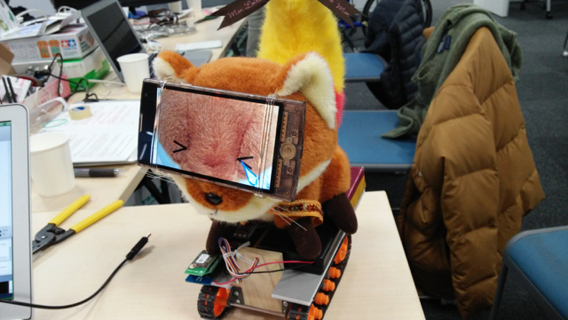
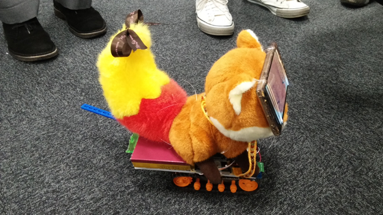

[Firefox OS WoTハッカソン](https://atnd.org/events/61749 "Firefox OS WoTハッカソン")に参加してみました。参加のきっかけはFx0を持っていることと、mbedを使うというところ、実際にIoTが経験できるという点からです。やはり１人で考えていても良いアイデアはでてきません。チームで取り組むことで全く思いもよらない応用が見つかるのではと思ったのです。

ハッカソンは初めての参加でしたので、やや不安もありましたが、mbedのあたりなら貢献できそうなので思い切って参加しました。

## 要件定義

チーム分けを行い、アイデアを練りはじめましたが、部材として持って行ったLEDマトリクスやNFCタグとかを眺めながら、Fx0とmbedを使ってIoT(WoT)を試して見るということで、まず「すごろく」というアイデアが出ました。すごろくのコースにスイッチを取り付けたり、NFCタグを使ってコースを進むと、LEDが光ったり、音がでたりとかそのようなものをイメージしていました。そしてそのすごろくの駒としてFx0にタイヤを付けたものを動かすのはどうだろうというアイデアもでてきました。

## 全体設計

結局、すごろくを作るか、Fx0の車を作るかの二択になりましたが、今回はFx0の車を作って、時間があったらすごろくを作ろうという話になりました。mbedやArduinoを使った車は作ったことがありますので、そのあたりのノウハウが役立つかなということで、モーター基台の担当となりました。そうこうしているうちにフォクすけくんのぬいぐるみを載せようということになり、アイデアが膨らんでいきました。また、「しっぽ」を振りたいという強い要望が加わりました。

ハッカソン後に整理したシステム構成図です。

## 実装

秋葉原に出かけて買って来たブルドーザーの基台にフォクすけ君をのせて実装イメージを確認しながら進めました。

フォクすけ君の実装イメージを確認したあとに、しっぽを振るための材料をまたまた秋葉原に買いに行きました。会場からそんなに遠くないので助かりましたが、結局１日目は秋葉原まで二往復しました。

以降、どのように作り上げたのかは、[Fabble](http://fabble.cc/dobogo/pitagoraxsugoroku "Fabble")にまとめておきましたのでそちらを参照ください。

[http://fabble.cc/dobogo/pitagoraxsugoroku](http://fabble.cc/dobogo/pitagoraxsugoroku "わらうフォクすけ")

## 完成したフォクすけ君

完成したフォクすけ君はこんな感じです。顔のFx0の画面で感情を表示します。このFx0がWebサーバとして動いていて、もう１台のFx0がリモコンとなりフォクすけ君が進む向きや表情の変更、しっぽ振りのON/OFFを行います。また、Fx0の近接センサーを利用して、目の前に手をかざすと目を閉じたり、後進するようなしかけも入っています。顔のFx0からmbedのWebサーバAPIをアクセスすることで３つのモータ（左、右、しっぽ）を制御します。

この手のものは発表のときに動かないということがよくあるのですが、今回はリトライしながらもなんとか動いてくれました。ちゃんとしっぽも振りましたし、電源ケーブルを乗り越えて元気よく走り回ってくれました。

YouTubeに動画も掲載しておきました。

https://youtu.be/DDcWNeSXqKw

https://youtu.be/oC6Vs4FJwPk

https://youtu.be/Jerkcrt3Ubg

## なんとARM賞を受賞！

この作品ですが、おかげさまでARM賞をいただくことができました。チームメンバーがそれぞれ得意な部分に取り組むことができ、マッチングが非常に良かったです。また、短時間で実際に動くものを作りあげることができ、Fx0のWebアプリの可能性が見えたように思います。

Team4のみなさん、参加されたみなさん、スタッフのみなさん、お疲れさまでした！

## 関連ページ

- [KDDI WoTハッカソン詳細情報](http://au-fx.kddi.com/event/20150214/wot_hackathon0214.html "KDDI WoTハッカソン詳細情報")
- [Firefox OS WoTハッカソン (mbed.org)](https://developer.mbed.org/users/MACRUM/notebook/firefox-os-wot-hackathon/ "Firefox OS WoTハッカソン")
- [笑うフォクすけ、どこでもダンスやサイクリング――KDDIが「Firefox OS WoTハッカソン」を開催](http://www.itmedia.co.jp/mobile/articles/1502/23/news154.html "笑うフォクすけ、どこでもダンスやサイクリング――KDDIが「Firefox OS WoTハッカソン」を開催")
