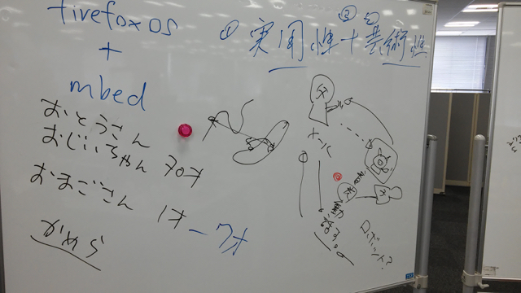
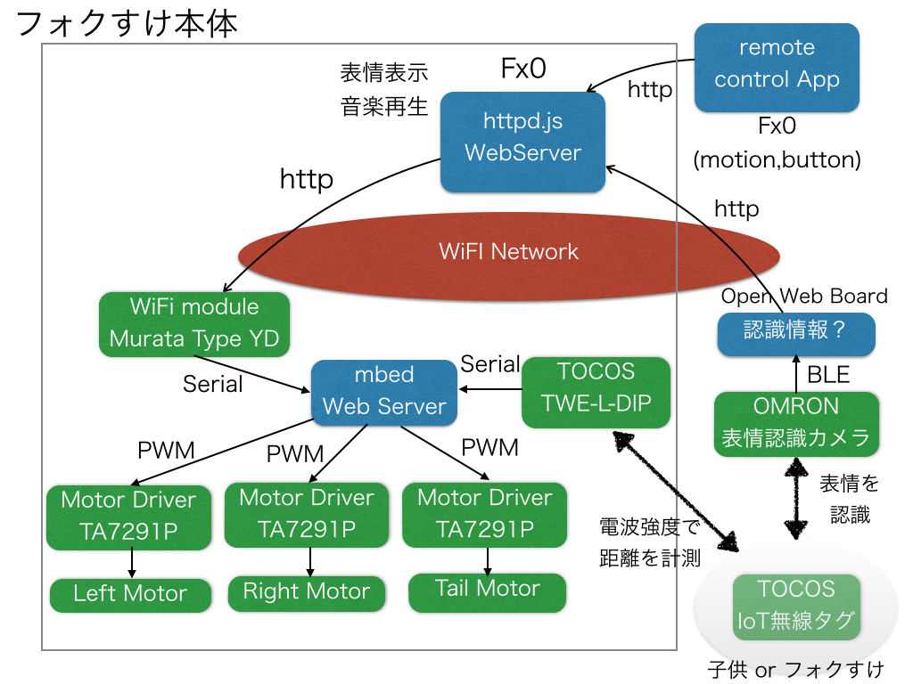
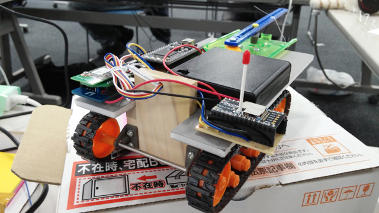
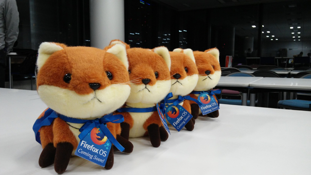

2015/3/14から3/15にかけて開催された au Firefox OS WoTハッカソン on ホワイトデーに参加しました。

前回の[au Firefox OS WoTハッカソン on バレンタインデー](https://kanpapa.com/2015/02/firefox-os-wot.html "au Firefox OS WoTハッカソン on バレンタインデー")では、「[わらうフォクすけ](http://fabble.cc/dobogo/pitagoraxsugoroku "わらうフォクすけ")」でARM賞をいただきました。今回はこの続きということでキャタピラ基台を持ち込みました。フォクすけ君は事務局のかたに準備していただきました。

旧チームメンバーはホワイトデーにちなんで、フォクすけ君の彼女を準備して、お返しのチョコを届けるようなものを考えていました。

他のチームではフォクすけ君が子供のお守りをするアイデアをだしていました。

この２つはベースの仕組みは同じになるということで、そちらのチームと合流して作業を進めることになりました。今回のチームは高専のメンバーが参加してフレッシュな雰囲気で始まりました。

材料としては前回作成した「わらうフォクすけ」のキャタピラ基台を使うことは確定で、それに加えて今回新しいデバイスとして[TOCOSのIoT無線タグTWE-Lite-2525A](http://www.tocos-wireless.com/jp/products/TWE-Lite-2525A/howtouse.html "TWE-Lite-2525A")を使うことにしました。この無線タグは「[ハルロック](http://morning.moae.jp/lineup/362 "ハルロック")」のネタから実現した「[ねこったー](http://tocos-wireless.com/jp/nekotter/ "ねこったー")」で使われていたものです。この無線タグからの電波強度である程度の距離がわかるとのこと。これを使ってフォクすけ君と彼女の距離や、見守る子供との距離を測ることを目指しました。

もう一つ新たなデバイスとして[OMRONの画像センシングモジュール「HVC-C」](http://plus-sensing.omron.co.jp/egg-project/product/ "HVC−C")を使うことにしました。このモジュールは人の状態を認識する独自の顔画像センシング技術「OKAO Vision」とカメラモジュールをコンパクトに一体化し、センシング結果をBluetoothでスマートフォンに送信することができるものだそうです。これで子供の表情を認識してそれに応じてフォクすけ君にアクションをさせようというアイデアでした。

TOCOSのIoTモジュールはシリアル通信で無線タグの情報が取得できるので、キャタピラ基台を制御している[mbed LPC1768](http://developer.mbed.org/platforms/mbed-LPC1768/ "mbed LPC1768")にシリアル接続することにしました。HVC-CはBLE通信になりますので、これに対応できるのは[OPEN WEB BOARD](http://opensource.kddi.com/owb/ "OPEN WEB BOARD")かなということで、OPEN WEB BOARDでHVC-Cから表情の情報を取り込むことをめざしました。

最終的なシステム構成図は以下のようになりました。

しかし、両方とも初めて使うデバイスであり作業は難航。私が担当したmbedとTOCOS TWE-Lite-DIPの接続の部分はWiFiを使いながらTOCOS TWE-Lite-DIPのシリアル通信を割り込み処理しようとするとハングアップしてしまいます。ARMの雪だるまさんの応援もいただいて、持ち込んだポケットオシロスコープで信号を確認しながら進めましたが、結局原因不明で途中で断念してしまいました。

TOCOS TWE-Lite-DIPはキャタピラ基台への実装まで行ったのですが、残念ながら本番時はこのモジュールは取り外して動かすことになりました。

また、OPEN WEB BOARDとHVC-Cの接続も難易度が高く時間切れとなってしまいました。

フォクすけ君の表情は彼女用にハートマークの表示も追加され、リモコンとなるFx0のUIが洗練されたものになりました。またフォクすけ君本体のFx0からは彼女との出会いを盛り上げるための音楽も鳴るようになりました。

ただ、mbedのところで時間をかけすぎてしまったため、前回大きな課題だった足回りの改良がまったく行えず、電池切れの不安を抱えながらのデモになりました。

残念ながら予感は的中し、デモのときはモーターがまったく動かず、手で押して彼女に接近させ、ハートマーク表示ができたという結果に終わってしまいました。

今回は他のチームでも同じようなキャタピラを使った作品がありましたが、そちらでは電源周りがモバイルバッテリーだったり、デジタル回路とモーター回路の電源系統を分けることで安定して走行していました。また、バッテリーや制御基板の搭載を行うために100円ショップのカゴを乗せる工夫もされていました。もし次回があるようであれば、今回できなかったところを全部クリアしたいと思います。

何はともあれ高専生のかたと一緒に作業できたのは楽しかったですし、組み込みデバイスやFirefox OSに大変興味をもっていただけたようでした。

なお、今回の作品はMozilla賞をいただき、３匹のフォクすけ君が賞品となりましたが、このフォクすけ君は高専生のかたに贈られました。

今回のプロジェクトで作成したFiddleのページはこちらになります。

[http://fiddle.cc/yamasy1549/mimamori-foxkeh](http://fabble.cc/yamasy1549/mimamori-foxkeh "見守りフォクすけ")

なかなか難易度が高かったですが楽しかったです。また機会があれば参加したいと思います。

関連ページ

- [au Firefox OS WoTハッカソン on ホワイトデー 詳細情報掲載！！](http://au-fx.kddi.com/information/27 "au Firefox OS WoTハッカソン on ホワイトデー 詳細情報掲載！！")
- [au Firefox OS WoTハッカソン on ホワイトデー レポート（前編）](http://au-fx.kddi.com/information/31 "au Firefox OS WoTハッカソン on ホワイトデー レポート（前編）")
- [au Firefox OS WoTハッカソン on ホワイトデー レポート（中編）](http://au-fx.kddi.com/information/32 "au Firefox OS WoTハッカソン on ホワイトデー レポート（中編）")
