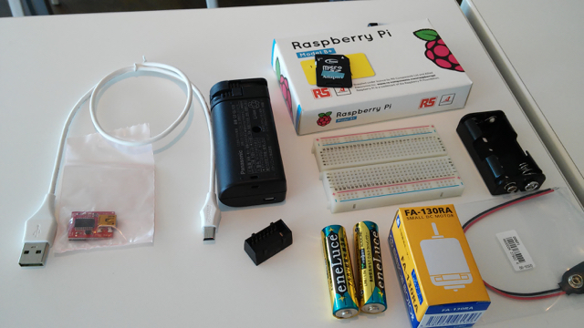
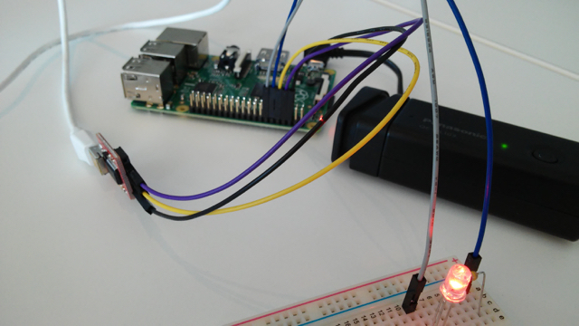

2015/4/26に開催されたFirefox OS & Raspberry Pi WoTハンズオンに参加してみました。

Firefox OSのハンズオンは以前にも参加したことはありますが、Raspberry Piとの連携をやったことがなかったので、良い機会と考えました。会場はMixiさんです。

最初に興味があったRaspberry Piのハンズオンに参加しました。

材料はこんな感じです。

- Raspberry Pi model B+
- microSDカード or SDカード
- USB WiFiアダプタ
- USB-シリアル変換ボード
- ブレッドボード
- 電池BOX（006Pスナップ付き）
- 単三電池２本
- モバイルバッテリー(miniUSBコネクタ付）
- モーター
- USBケーブル
- モータードライバIC
- 抵抗
- LED
- 配線材料

今回のハンズオンは配布されたPDFのテキストに従って各自もくもく進める形式でした。不明な点があったらチューターのかたにその都度質問をするという形です。

Raspberry PiのOSや必要なソフトウェアはすでにSDカードに書き込み済で、すぐハンズオンに取りかかれましたが、最初にUSB-シリアル変換ボードを使ってシリアルコンソールでRaspberry Piにログインすることになります。このあたりはこれまで経験がありましたので、スムーズに行うことができました。

次にNode.jsを使いJavaScriptのプログラムでハードウェアの制御を行っていきます。このあたりは未経験なのですが、思ったよりは簡単に進みLチカまではできました。

さて次に進もうかと思っていたところに知り合いの講師のかたに肩を叩かれ、

「すみません。チューターを手伝ってください・・・。」

実は最初のステップのシリアルコンソール接続でRaspberry Piにログインできない人が多く、急遽サポーターとしてお手伝いすることになりました。

ハンズオンのゴールとしては、エミュレーター上のFirefox OSアプリからWebSocketでRaspberry Piと通信し、PWMでモーターを制御するというものでしたが、マニュアルに誤記があったり、WiFiネットワークにRasberry Piがうまく接続できなかったり、その後もトラブル続出でした。

実際にハンズオンでモーターが制御できた動画を載せておきます。この動画には写っていませんが、Firefox OSアプリにスライダーが表示されていて、それを動かすとモーターの回転数が変化するというデモになります。

これまではハンズオンやハッカソンに参加者としての立場で参加してきましたが、今回ひょんなことから運営側の経験ができて、いかに事前準備が大変だということがわかりました。私も運営側としてお手伝いできることがあれば参加していきたいと思います。開催者の皆様お疲れ様でした。

【追記】

ハンズオンで使用したULN2003Aの代わりに、[TD62083APG](http://akizukidenshi.com/catalog/g/gI-01516/ "TD62083APG")を使って同様な動作ができることを確認しました。
