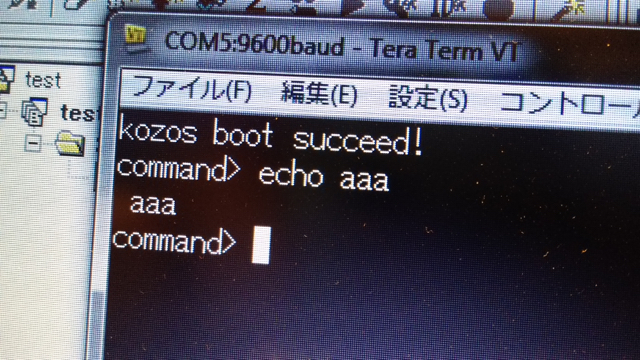

KOZOSはフルスクラッチの小さなOSです。今回は以前cygwin上に作成したH8 gccクロスコンパイル環境を使って開発をします。KOZOSのターゲットボードは[H8/3069Fネット対応マイコンLANボード(K-01271)](http://akizukidenshi.com/catalog/g/gK-01271/ "K-01271")であり、今回のH8/3048F-ONE評価基板とCPUが違います。CPUのコアはH8/300Hなので同じですがフラッシュROMとRAMの容量が異なり、それに伴ってメモリマップも変わってきます。

- H8/3069F ・・・・CPU内蔵 フラッシュROM 512KB、RAM 16KB
- H8/3048F-ONE・・CPU内蔵 フラッシュROM 128KB、RAM 4KB

この評価基板には外部フラッシュROMや外部RAMも実装されているのですが、この時点ではどのようなメモリマップに配置されているのかがわからないので、CPUの内蔵ROM/RAMのみを使います。  
ROMはともかくRAMが4KBしかない点が気になりますが、まずはできるところまでやってみようと考えました。

KOZOS本（「[12ステップで作る 組込みOS自作入門](http://kozos.jp/books/makeos/ "12ステップで作る 組込みOS自作入門")」）を見て思い出しながら作業を進めました。

まずはシリアルへの文字出力から。

問題なく表示できました。

次はbootloaderの移植です。メモリマップを合わせてこちらも動きました。

この状態でXMODEMでのバイナリアップロードができるようになりました。

ELFのヘッダ解析も問題なくできています。

bootloaderも動いたところで、いよいよKOZOSを動かしたいところなのですが、RAMの容量の関係でXMODEの受信バッファにKOZOSが収まりません。このため、bootloaderを使わずに直接KOZOSをフラッシュROMに書き込むことにしました。

内蔵フラッシュROMからKOZOSがbootして、echoの動作確認ができました。

H8/3048F- ONEではフラッシュROMの書き込みは100回程度しか行えないとのことなので、本来であればフラッシュROMにはbootloaderだけ書き込ん で、KOZOS本体はシリアルから読み込んでbootすべきなのですが、これから先は4KBの内蔵RAMだけでは動かすことができません。どうしても外部 RAMを使うことになります。しかし、このあたりの仕様は不明です。

いろいろ調べたところルネサスのホームページで[H8のモニタプログラム](http://japan.renesas.com/support/seminar/sample_program/index.jsp "H8モニタープログラム")を見つけました。このモニタプログラムを動かすことができればメモリダンプや書き込み、プログラムの実行など基板の解析に必要な作業ができそうです。

KOZOSの移植は一旦中断して、このモニタプログラムの移植を開始しました。

（続く）
