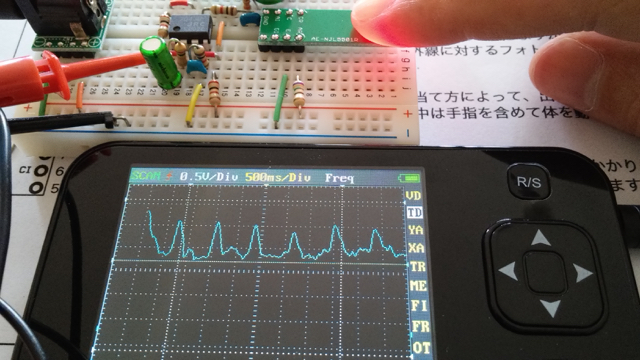

秋月電子で[パルスオキシセンサ](http://akizukidenshi.com/catalog/g/gK-09433/ "ＮＪＬ５５０１Ｒ搭載　パルスオキシメータ用・反射型センサ　ＤＩＰ化モジュールキット ")が新発売になっていました。価格も安かったので１つ買って使用例の回路をブレッドボードで組んで脈波 を見てみました。回路も簡単ですのでブレッドボードできれいに組めたのではと思います。

この回路にデジタルオシロスコープを接続しますが、手持ちのDSO Nanoを使ってみました。なかなか波形が安定しなかったのですが、指をじっと固定してしばらく待つと脈波のようなものが表示できました。

一応動いているようには見えます。規則的に波が表示されています。秋月電子の回路例では赤色LEDを光源にしていますが、近赤外線LEDを使うという方法もあるようです。このようなオペアンプを使った回路はPSoCとかに置き換えができるのでしょうか。そのあたりも試してみようと思います。
