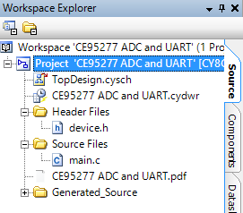
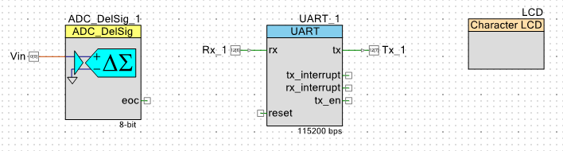
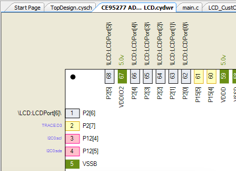
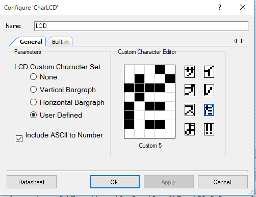
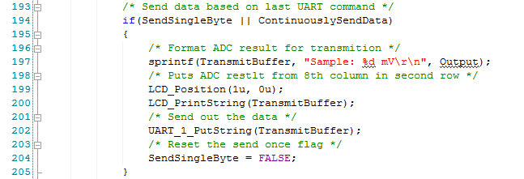

前回、PSoC 5LP Prototyping KitでLチカを行いましたが、CY8CKIT-059のサンプルとして用意されているADCとUARTを使った電圧計を動かしてみます。

サンプルプロジェクトを開きます。

 <!--more-->

TopDesignを開くと、ADCとUARTのコンポーネントが登録されており、この状態でビルドしてターゲットに書き込むと、電圧の数値がUART経由で表示できます。私の場合はTeraTermでUARTに接続しました。

UART経由でコマンドを入力することで、連続して計測したり、サンプリングして計測することができます。

ここで折角GPIO端子がたくさんあるので、電圧のLCD表示ができないかなと思いコンポーネントを探したところ、手持ちのLCD(HD44780)に適合するコンポーネントがありました。これをTopDesignにくみこみます。

次にPSoCのどのポートにLCDを接続するかを設定します。今回はP2\[0-6\]を使っています。こちらも図で確認できます。

LCDコンポーネットをクリックしたところ、ユーザ定義文字を定義する機能もあるようです。 ついでなのでカタカナ、ひらがなをデザインしてみました。

ここで設定したユーザ定義文字はLCD\_CustChars.cにフォントデータとして自動生成されます。

ここまで出来たら、main.cでLCDにも表示するように書き換えます。

ユーザ定義文字の表示は自動生成されたフォント名をLCD\_PutChar()に指定するだけです。

電圧表示はUARTに出力している文字列をそのままLCD\_PrintString()に渡すだけでお手軽です。

完成したものはこちらです。ユーザ定義文字もADCからの電圧もLCDに表示されています。

LCD表示についてはサンプルプログラムがありましたので、そちらを参考にすることで簡単に組み込むことができました。

他にもいろいろなデバイスがサポートされていますので、今後試していきたいと思います。
