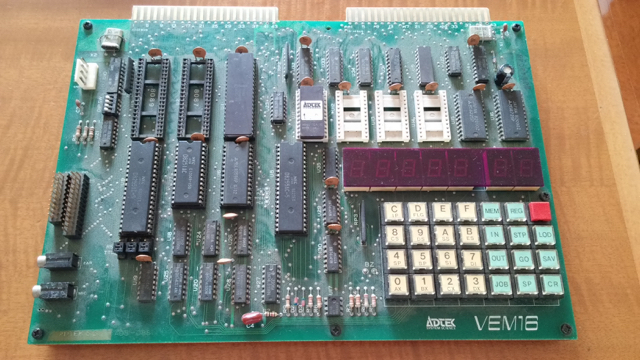
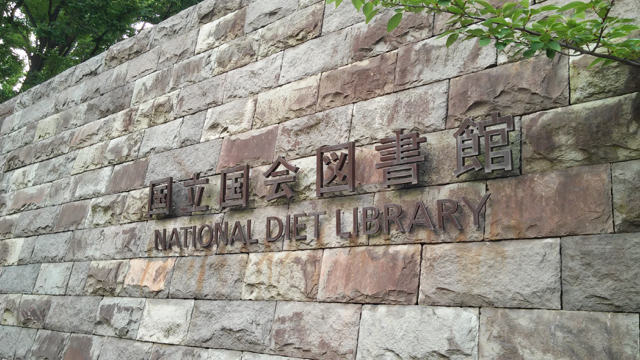
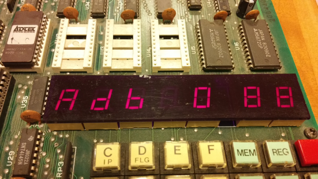

ヤフオクでVEM16という8088トレーニングボードを手にいれました。お値段は2100円。有名どころのTK-80やLkit-16といったトレーニングマイコンはそれなりの価格になりますが、このVEM16は知名度も低く私もあまり知らないものです。でも、CPUは16ビットの8088。昔はIBM-PC/XTを持っていたので8088は懐かしく感じます。

メーカーはADTEKシステムサイエンスのようですが、すでにこの会社は無くなってしまったようです。

VEM16で検索したところ、 技術情報はありませんでしたが、古本屋のサイトで「VEM16 全回路図」という記事がひっかかりました。その記事が載っている雑誌はあの工学社の月間I/O誌で、1983年5月号とのことです。私も実家にはある程度 のI/O誌を保管していますが、この号は持っていません。

でも心配することはありません。こういう時は[国立国会図書館](http://www.ndl.go.jp/ "国立国会図書館")です。日本で発行されたほとんどの本がここにあります。以前に国立国会図書館に行ったときに利用者登録をしておいたので、目的のI/O誌を閲覧しに出かけました。

国立国会図書館の利用は難しくありません。最初に利用者登録を行い利用者カードを作成しておけば、開館中いつでも書籍の閲覧・複写を行うことができます。

早 速、目的のI/O誌を検索して、閲覧申請をすると20〜30分で閲覧カウンターに到着します。館内は撮影禁止なので写真は載せられませんが、雑誌といえど もしっかり厚い背表紙に製本されて永久保存できる体裁になっています。I/O誌も立派な百科事典のようになっています。

閲覧して目的の記事を見つけたら、複写申請書を作成して、しおりをはさみ、複写を依頼します。こちらは申請から15分程度で複写カウンターに届きます。今回は７ページでしたが見開きでお願いしたので４枚で複写代は100円程度でした。

ひ さしぶりに古いI/O誌を見ましたが、広告のページが160ページぐらいあって、まるで昔のトラ技のようでした。1983年はもりあがっていたんですね。 広告にはタモリさんも載っていましたし、I/Oバザールという物々交換のページには住所、氏名、電話番号がそのまま載っていて今では想像がつきません。

自宅に帰って、複写したページの内容を実物を比較したところまさにこの製品の記事でした。たいへん参考になります。全回路図も載っているので拡張もできそうです。

いろいろいじっていると7セグLEDが表示されるようになりました。

まずはモニタROMを吸い出して、その解析を行ってみようと思います。ROMは2732ですので4KBと小さく解析には手頃なサイズです。また良いおもちゃを手に入れてしまいました。
