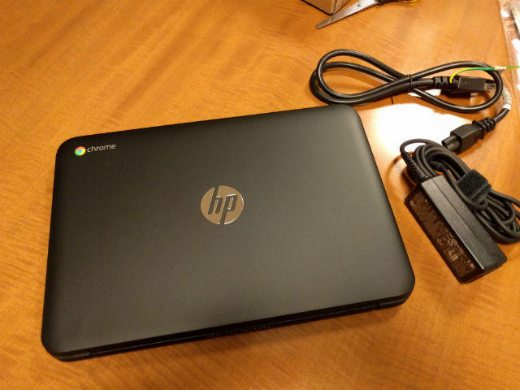
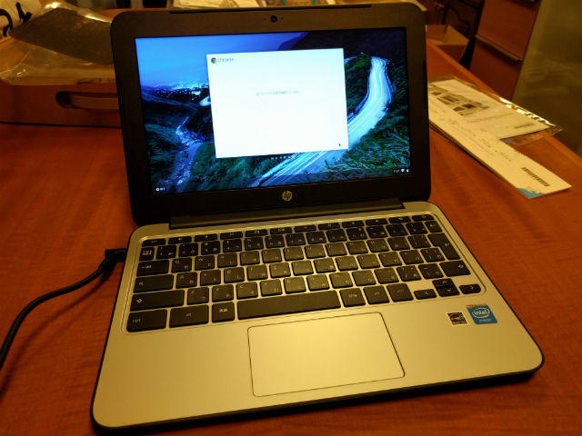
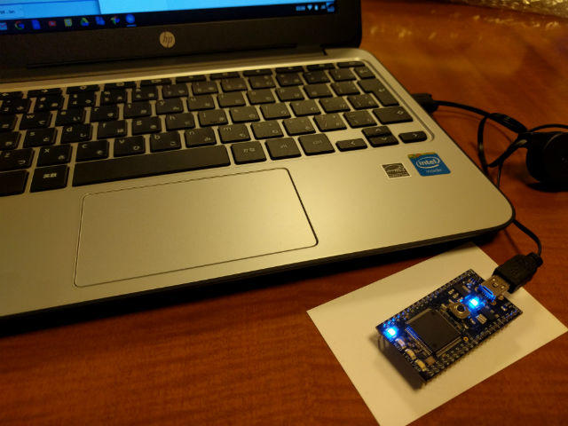

TwitterにChromebookが2万円というツイートが流れてきました。Amazonのタイムセールのようです。

Chromebookという名前は聞いたことがありますが、これまで実際に使ったことはありません。

思えば、最近はクラウドの利用が多くなり、Google AppsやGoogle Driveをよく使うようになっています。今の利用スタイルであればChromebookでもありなのかもと自分へのお年玉としてChromebookを購入してみました。

購入した機器はHP Chromebook 11 G3です。メモリが4GBなのにこの価格ということで手頃だと思います。

外観はこんな感じです。HPのロゴとChomeのロゴが入っています。11インチなので大きさはMacBook Airぐらいです。残念ながら厚みはそれほど薄くはありません。

早速電源をいれてセットアップを行いました。指示とおりに入力すればあっという間に使えるようになります。ネットワークは必須ですが。

キーボードはMacBook Airぽい感じです。色合いもですね。

まずは、Gmailを開いたところ、このChromeは古いので使えないというメッセージが表示されました。このためまずは本体のアップデートを行いました。

アップデートには少し時間がかかりましたが、完了後に無事Gmailが使えるようになりました。

私にとって必要なものはTwitterですが、ChromeアプリでTweetDeckがありましたのでそれを使っています。あとはGoogle KeepやGoogleドキュメント、Googleフォト、画像編集ソフトのPixlr Editor、サーバ管理に使うsecure shellなどアプリストアからインストールして必要なものはChromeアプリで揃えることができました。

あと、使ってみたかったのはmbedの開発環境です。mbedはクラウドでコンパイルしますので、ブラウザがあれば開発ができますので、このChromebookでも使えるはずです。

早速、Chromebookでmbedのサイトにアクセスし、LチカのソースをコンパイルしたバイナリをUSBで接続したmbedにコピーすることができました。

mbedとChromebookは相性がいいですね。

あと、Chromebookの購入特典としてGoogle Driveが100GB増量される点も見逃せません。

動作スピードも快適で、かな漢字変換もスムーズ。電池の持ちはすごく良いですね。購入直後に充電してからまだ１回も充電していません・・・。

なかなかバランスが取れているマシンで、いろんなことができそうなので、外にも持ち出して使ってみようかと思います。

もちろん、この記事もChromebookだけで作成できました。
