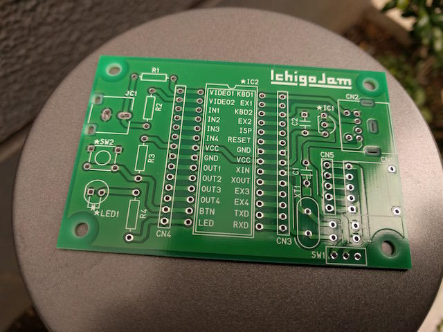
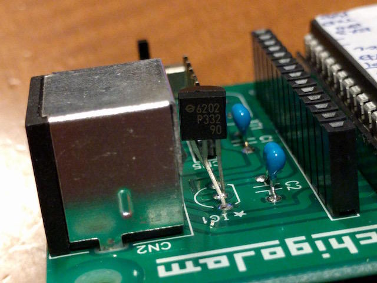

秋月電子で[IchigoJam U用プリント基板（通販コード P-10037）](http://akizukidenshi.com/catalog/g/gP-10037/ "IchigoJam U用プリント基板")が売られていたので思わず２枚買ってしまいました。手持ちの部品で２台ぐらいは作れると思いましたので。

 <!--more-->

以前にIchigoJamをブレッドボードに組んでそのままになっていたのでこの専用基板に載せ替えてみました。

12MHzのXTALは手持ちがなかったのですが、それ以外は手持ちのパーツを使って実装しました。

ただし、ブレッドボードで使っていた[3.3Vレギュレーター（XC6202P332TH）](http://akizukidenshi.com/catalog/g/gI-09119/ "XC6202")の足がこの基板の配置とは合っていなかったので、足を少し折り曲げて無理やり合わせています。手持ちのパーツを使うときはこのような点に気をつける必要があります。ちなみにレギューレーターの接続を間違えるとすごく熱くなってパシッと音がして壊れます・・・。

無事動作も確認し、ついでにファームウェアをアップデートしておきました。

これで最新版のIchigoJamの完成です。
